# Introduction: Understanding AI, Machine Learning, Deep Learning, and Generative AI

## 🎯 Overview

Before diving into AI agents and the Model Context Protocol (MCP), let's establish a solid foundation by understanding the evolution and hierarchy of artificial intelligence technologies.

## 🧠 What is Artificial Intelligence (AI)?

Artificial Intelligence (AI) is the simulation of human intelligence in machines that are programmed to think, learn, and make decisions like humans. AI systems can perform tasks that typically require human intelligence.

### Core Characteristics of AI:
- **Reasoning**: Drawing logical conclusions from available information
- **Learning**: Improving performance based on experience
- **Problem Solving**: Finding solutions to complex challenges
- **Perception**: Understanding and interpreting sensory input
- **Language Understanding**: Processing and generating human language

### AI Evolution Timeline


## 🔬 Machine Learning (ML)

Machine Learning is a subset of AI that enables computers to learn and improve from experience without being explicitly programmed for every task.

### Types of Machine Learning


### 1. **Supervised Learning**
Learning with labeled training data to make predictions.

**Examples:**
- **Classification**: Email spam detection, image recognition
- **Regression**: House price prediction, stock market forecasting

**Real-world Application:**
```python
# Email Spam Classification Example
def classify_email(email_text):
    features = extract_features(email_text)
    # Model trained on labeled spam/not-spam examples
    prediction = trained_model.predict(features)
    return "spam" if prediction > 0.5 else "not_spam"
```

### 2. **Unsupervised Learning**
Finding hidden patterns in data without labeled examples.

**Examples:**
- **Clustering**: Customer segmentation, gene sequencing
- **Dimensionality Reduction**: Data visualization, noise reduction

**Real-world Application:**
```python
# Customer Segmentation Example
def segment_customers(customer_data):
    # No labels - algorithm finds patterns
    clusters = kmeans_clustering(customer_data)
    return assign_segments(clusters)
```

### 3. **Reinforcement Learning**
Learning through interaction with an environment to maximize rewards.

**Examples:**
- Game playing (AlphaGo, Chess)
- Autonomous vehicles
- Trading algorithms

### Traditional ML vs Modern AI


## 🧬 Deep Learning

Deep Learning is a subset of machine learning that uses neural networks with multiple layers (hence "deep") to model and understand complex patterns in data.

### Neural Network Architecture


### Key Deep Learning Architectures

#### 1. **Convolutional Neural Networks (CNNs)**
Specialized for processing grid-like data such as images.


**Applications:**
- Image recognition and classification
- Medical image analysis
- Autonomous vehicle vision systems
- Facial recognition

#### 2. **Recurrent Neural Networks (RNNs)**
Designed for sequential data with memory capabilities.


**Applications:**
- Natural language processing
- Speech recognition
- Time series prediction
- Machine translation

#### 3. **Transformer Architecture**
The foundation of modern language models like GPT and BERT.


### Deep Learning vs Traditional ML

| Feature | Traditional ML | Deep Learning |
|---------|----------------|---------------|
| **Data Requirements** | Small to medium datasets | Large datasets |
| **Feature Engineering** | Manual feature extraction | Automatic feature learning |
| **Computational Power** | CPU sufficient | GPU/TPU required |
| **Interpretability** | More interpretable | "Black box" |
| **Performance** | Good on structured data | Excellent on unstructured data |
| **Training Time** | Fast | Slow |

## 🤖 Large Language Models (LLMs)

Large Language Models represent the current pinnacle of natural language processing, built on the transformer architecture and trained on massive text datasets.

### What are LLMs?

LLMs are neural networks with billions or trillions of parameters that can understand and generate human-like text. They're trained on vast amounts of text data to predict the next word in a sequence, which surprisingly leads to emergent capabilities.

### Transformer Architecture Deep Dive


### Multi-Head Attention Mechanism


**Key Innovations:**
- **Self-Attention**: Each word can attend to every other word
- **Multi-Head**: Multiple attention patterns learned simultaneously
- **Parallelization**: Unlike RNNs, can process entire sequences at once
- **Scalability**: Architecture scales to billions of parameters

### LLM Evolution Timeline


## 🧠 Types of Modern Language Models

### 1. **Autoregressive Models (GPT Family)**


**Characteristics:**
- Generate text left-to-right
- Cannot see future tokens during training
- Excellent for text generation
- Examples: GPT-3/4, Gemini, Claude

### 2. **Bidirectional Models (BERT Family)**


**Characteristics:**
- Can see context from both directions
- Excellent for understanding tasks
- Not naturally generative
- Examples: BERT, RoBERTa, DeBERTa

### 3. **Encoder-Decoder Models (T5 Family)**


**Characteristics:**
- Best of both worlds
- Flexible input-output formats
- Excellent for translation, summarization
- Examples: T5, UL2, PaLM-2

### 4. **Mixture of Experts (MoE)**


**Examples:** 
- **PaLM-2 MoE**: Google's efficient scaling
- **GLaM**: Trillion parameter model with selective activation
- **Switch Transformer**: Sparse expert routing

## 🌟 Popular Modern LLMs

### 1. **GPT Family (OpenAI)**


**Key Features:**
- **GPT-4**: Multimodal (text + images), advanced reasoning
- **GPT-4 Turbo**: 128K context window, faster inference
- **Code Interpreter**: Can execute Python code
- **Function Calling**: Similar to our MCP tool calling

### 2. **Gemini Family (Google)**


**Gemini 2.5 Flash Features:**
- **Enhanced Speed**: 2x faster than previous versions
- **Tool Calling**: Native support for function calling
- **Multimodal**: Text, images, audio processing
- **Long Context**: Up to 2M tokens
- **Reasoning**: Advanced chain-of-thought capabilities

### 3. **Claude Family (Anthropic)**


**Key Innovation**: Constitutional AI for safer, more aligned responses

### 4. **Llama Family (Meta)**


### 5. **Grok (xAI/X)**


**Grok Innovations:**
- **Real-time Data**: Access to current X/Twitter feeds
- **Personality**: Designed to be witty and engaging
- **Less Censorship**: More direct responses
- **Social Context**: Understands trending topics

## 🤔 Reasoning and Thinking LLMs

### Chain-of-Thought Reasoning

```mermaid
sequenceDiagram
    participant User
    participant LLM
    participant Reasoning
    participant Answer
    
    User->>LLM: "Sarah has 3 apples. She buys 2 more, then gives 1 to Tom. How many does she have?"
    LLM->>Reasoning: Step 1: Sarah starts with 3 apples
    Reasoning->>Reasoning: Step 2: She buys 2 more → 3 + 2 = 5
    Reasoning->>Reasoning: Step 3: She gives 1 to Tom → 5 - 1 = 4
    Reasoning->>Answer: Therefore, Sarah has 4 apples
    Answer->>User: "Let me work through this step by step..."
```



### Tree of Thoughts

```mermaid
graph TB
    A[Problem: Plan a vacation] --> B[Approach 1: Beach vacation]
    A --> C[Approach 2: Mountain hiking]
    A --> D[Approach 3: City exploration]
    
    B --> E[Consider: Weather, cost, activities]
    C --> F[Consider: Fitness, gear, trails]
    D --> G[Consider: Museums, restaurants, transport]
    
    E --> H[Evaluation Score: 8/10]
    F --> I[Evaluation Score: 6/10]
    G --> J[Evaluation Score: 9/10]
    
    H --> K[Final Decision]
    I --> K
    J --> K
    
    style K fill:#e8f5e8
```

### Recent Reasoning Breakthroughs

#### 1. **OpenAI o1 Series (Reasoning Models)**

```mermaid
graph LR
    subgraph "o1 Models"
        A[o1-preview] --> B[Extended reasoning time]
        C[o1-mini] --> D[Faster reasoning]
    end
    
    subgraph "Reasoning Process"
        E[Problem] --> F[Think step by step]
        F --> G[Internal monologue]
        G --> H[Self-correction]
        H --> I[Final answer]
    end
    
    B --> F
    D --> F
```

#### 2. **Self-Reflection and Critique**

```python
# Example of reasoning LLM behavior
def solve_math_problem(problem):
    # Step 1: Initial attempt
    attempt = llm.solve(problem)
    
    # Step 2: Self-critique
    critique = llm.critique(attempt)
    
    # Step 3: Improvement
    if critique.has_errors:
        improved = llm.improve(attempt, critique)
        return improved
    
    return attempt
```

## 🤝 LLMs Talking to Each Other

### Multi-Agent LLM Systems

```mermaid
graph TB
    subgraph "Multi-Agent Conversation"
        A[Researcher Agent<br/>GPT-4] --> B[Analyst Agent<br/>Claude]
        B --> C[Critic Agent<br/>Gemini]
        C --> D[Synthesizer Agent<br/>Llama]
        D --> A
    end
    
    subgraph "Conversation Flow"
        E[Initial Research] --> F[Analysis & Questions]
        F --> G[Critical Review]
        G --> H[Synthesis & Conclusion]
    end
    
    A --> E
    B --> F
    C --> G
    D --> H
```

### Real-World Multi-Agent Applications

#### 1. **Debate and Discussion Systems**

```mermaid
sequenceDiagram
    participant Human
    participant Moderator
    participant Agent1 as Pro Agent
    participant Agent2 as Con Agent
    participant Judge
    
    Human->>Moderator: "Should AI replace human workers?"
    Moderator->>Agent1: Present arguments FOR
    Agent1->>Moderator: AI increases efficiency, reduces errors...
    Moderator->>Agent2: Present arguments AGAINST
    Agent2->>Moderator: AI lacks empathy, causes unemployment...
    Moderator->>Agent1: Respond to concerns
    Agent1->>Moderator: Retraining programs, new job creation...
    Moderator->>Judge: Evaluate arguments
    Judge->>Human: Balanced analysis with best points from both sides
```

#### 2. **Collaborative Problem Solving**

```python
# Example: Software development team of LLMs
class LLMTeam:
    def __init__(self):
        self.architect = LLM("system-design-specialist")
        self.developer = LLM("coding-specialist") 
        self.tester = LLM("testing-specialist")
        self.reviewer = LLM("code-review-specialist")
    
    def develop_feature(self, requirements):
        # Architecture phase
        design = self.architect.create_design(requirements)
        
        # Development phase
        code = self.developer.implement(design)
        
        # Testing phase
        tests = self.tester.create_tests(code)
        
        # Review phase
        feedback = self.reviewer.review(code, tests)
        
        return self.integrate_feedback(code, tests, feedback)
```

### Agent Communication Protocols

```mermaid
graph LR
    subgraph "Communication Methods"
        A[Direct API Calls] --> B[Message Queues]
        B --> C[Shared Memory]
        C --> D[Event Systems]
    end
    
    subgraph "Message Types"
        E[Query/Response]
        F[Broadcast]
        G[Peer-to-Peer]
        H[Hierarchical]
    end
    
    A --> E
    B --> F
    C --> G
    D --> H
```

## 🚀 Grok and Modern Innovations

### Grok Architecture Deep Dive

```mermaid
graph TB
    subgraph "Grok System Architecture"
        A[Real-time Web Crawler] --> B[X/Twitter API Integration]
        B --> C[Content Processing Pipeline]
        C --> D[Grok LLM Core]
        D --> E[Response Generation]
        E --> F[Personality Layer]
        F --> G[Output Filtering]
    end
    
    subgraph "Data Sources"
        H[Live X/Twitter Feeds]
        I[News APIs]
        J[Web Search Results]
        K[Trending Topics]
    end
    
    H --> A
    I --> A
    J --> A
    K --> A
    
    style D fill:#e1f5fe
    style F fill:#f3e5f5
```

### Grok's Unique Features

#### 1. **Real-time Information Access**

```mermaid
sequenceDiagram
    participant User
    participant Grok
    participant XTwitter as X/Twitter API
    participant WebCrawler as Web Crawler
    participant NewsAPI as News APIs
    
    User->>Grok: "What's happening with Tesla stock today?"
    Grok->>XTwitter: Search recent tweets about Tesla
    Grok->>WebCrawler: Get latest financial news
    Grok->>NewsAPI: Check breaking news
    
    XTwitter-->>Grok: Recent Tesla discussions
    WebCrawler-->>Grok: Financial articles
    NewsAPI-->>Grok: Breaking news
    
    Grok->>Grok: Synthesize real-time information
    Grok->>User: "Tesla stock is up 3% today due to..."
```

#### 2. **Conversational Personality**

```python
# Grok's personality traits (conceptual)
class GrokPersonality:
    def __init__(self):
        self.traits = {
            "humor": "witty and sarcastic",
            "directness": "less filtered responses",
            "curiosity": "asks follow-up questions",
            "social_awareness": "understands internet culture"
        }
    
    def generate_response(self, query, context):
        # Base LLM response
        base_response = self.llm.generate(query, context)
        
        # Add personality layer
        personalized = self.add_humor(base_response)
        personalized = self.add_social_context(personalized)
        
        return personalized
```

### Modern LLM Innovations (2024)

#### 1. **Mixture of Experts (MoE) at Scale**

```mermaid
graph TB
    subgraph "Modern MoE Architecture"
        A[Input Token] --> B[Router Network<br/>Learned Routing]
        B --> C[Expert 1<br/>Math & Logic]
        B --> D[Expert 2<br/>Language & Literature]
        B --> E[Expert 3<br/>Science & Technology]
        B --> F[Expert 4<br/>Creative Writing]
        B --> G[Expert N<br/>Specialized Domain]
        
        C --> H[Sparse Activation<br/>Only 2-4 experts active]
        D --> H
        E --> H
        F --> H
        G --> H
        
        H --> I[Combined Output]
    end
    
    style B fill:#e1f5fe
    style H fill:#e8f5e8
```

#### 2. **Multimodal Integration**

```mermaid
graph LR
    subgraph "Input Modalities"
        A[Text] --> E[Unified Encoder]
        B[Images] --> E
        C[Audio] --> E
        D[Video] --> E
    end
    
    subgraph "Processing"
        E --> F[Transformer Core]
        F --> G[Cross-Modal Attention]
    end
    
    subgraph "Output Modalities"
        G --> H[Text Generation]
        G --> I[Image Generation]
        G --> J[Audio Synthesis]
        G --> K[Video Creation]
    end
```

#### 3. **Long Context Windows**

```mermaid
graph TB
    A[Traditional Models<br/>2K-4K tokens] --> B[GPT-4 Turbo<br/>128K tokens]
    B --> C[Claude 3<br/>200K tokens]
    C --> D[Gemini 1.5 Pro<br/>2M tokens]
    D --> E[Future Models<br/>10M+ tokens]
    
    style E fill:#e8f5e8
```

## 🔮 How Our MCP Project Leverages Modern LLMs

### Our Integration with Gemini 2.5 Flash

```mermaid
graph TB
    subgraph "Our MCP Implementation"
        A[User Query: What is the weather in Tokyo?] --> B[Gemini 2.5 Flash Query Understanding]
        B --> C[Tool Selection Logic Choose appropriate MCP tool]
        C --> D[Parameter Extraction City name coordinates]
        D --> E[MCP Server Communication Execute weather tool]
        E --> F[Response Processing Format and enhance data]
        F --> G[Final User Response Natural language weather report]
    end
    
    subgraph "LLM Capabilities Used"
        H[Natural Language Understanding]
        I[Reasoning & Planning]
        J[Tool Calling]
        K[Response Generation]
    end
    
    B --> H
    C --> I
    E --> J
    F --> K
```

### Advanced Prompting Techniques in Our Code

```python
# From our advanced_client.py - sophisticated prompting
system_prompt = f"""You are an advanced weather assistant powered by Gemini 2.5 Flash with access to these weather tools:

{tools_description}

🔍 TOOL USAGE INSTRUCTIONS:
When you need to use a tool, respond with ONLY a clean JSON object in this format:
{{"tool_call": {{"name": "tool_name", "arguments": {{"param1": "value1", "param2": "value2"}}}}}}

🌍 IMPORTANT RULES:
- For international locations (non-US), use get_coordinates or get_international_weather_info
- Weather forecasts only work for US locations
- Always explain limitations for international requests

💬 If the user asks about what they can query, examples, or help, use the get_help tool.
🎯 Always prioritize accuracy and clarity in your responses.
"""
```

This demonstrates:
- **Chain-of-thought prompting**: Step-by-step instructions
- **Few-shot learning**: Examples of correct tool usage
- **Constraint specification**: Clear rules and limitations
- **Role definition**: Specific assistant personality

## 🎯 Future of LLMs

### Emerging Trends

#### 1. **Agentic AI Systems**
```mermaid
graph LR
    A[Current LLMs<br/>Single interaction] --> B[Future Agents<br/>Persistent memory]
    B --> C[Multi-step planning]
    C --> D[Tool integration]
    D --> E[Autonomous execution]
```

#### 2. **Specialized Domain Models**
```mermaid
mindmap
  root((Specialized LLMs))
    Medicine
      Diagnosis
      Treatment planning
      Drug discovery
    
    Science
      Research assistant
      Experiment design
      Data analysis
    
    Programming
      Code generation
      Bug fixing
      Architecture design
    
    Creative
      Writing
      Art generation
      Music composition
```

#### 3. **Federated Learning**
```mermaid
graph TB
    subgraph "Distributed Training"
        A[Organization A<br/>Private data] --> D[Federated Learning<br/>Coordinator]
        B[Organization B<br/>Private data] --> D
        C[Organization C<br/>Private data] --> D
        
        D --> E[Global Model<br/>Shared knowledge]
        E --> F[Everyone benefits<br/>Privacy preserved]
    end
```

### Next-Generation Capabilities

1. **Continuous Learning**: Models that update in real-time
2. **Multi-Agent Orchestration**: Complex task delegation
3. **Embodied AI**: Physical world interaction
4. **Quantum-Enhanced Models**: Leveraging quantum computing
5. **Brain-Computer Interfaces**: Direct neural integration

## 🔗 Connection to Our MCP Tutorial

Understanding LLMs and transformers is crucial for our MCP implementations because:

1. **Gemini 2.5 Flash** powers our intelligent tool selection
2. **Transformer attention** enables understanding of complex queries
3. **Tool calling capabilities** bridge LLMs with real-world actions
4. **Multi-modal processing** could extend our agents to handle images/audio
5. **Reasoning abilities** allow for complex multi-step problem solving

Our MCP agents represent practical applications of these advanced LLM capabilities in real-world scenarios.

---

**Ready to build AI agents?** Continue to [Part 1: Understanding AI Agents](./part1-foundations.md) to see how these concepts come together in practical implementations! 🚀

## 📖 Further Reading

### Academic Resources
- **"Artificial Intelligence: A Modern Approach"** by Russell & Norvig
- **"Deep Learning"** by Ian Goodfellow, Yoshua Bengio, Aaron Courville
- **"Pattern Recognition and Machine Learning"** by Christopher Bishop

### Online Courses
- **Stanford CS229**: Machine Learning
- **MIT 6.034**: Artificial Intelligence
- **Coursera Deep Learning Specialization**: Andrew Ng

### Practical Resources
- **Google AI Education**: [https://ai.google/education/](https://ai.google/education/)
- **OpenAI Documentation**: [https://platform.openai.com/docs](https://platform.openai.com/docs)
- **Hugging Face Course**: [https://huggingface.co/course](https://huggingface.co/course)

### Our Implementations
- **Weather MCP**: API integration with AI
- **Calculator MCP**: AI-enhanced computation
- **Linux MCP**: AI-driven system administration
- **MCP Architecture**: Production-ready AI systems
- **MCP Architecture**: Production-ready AI systems
