# AWS MCP Cloud Management Agent

A comprehensive AWS cloud management and monitoring agent built with the Model Context Protocol (MCP) and powered by Google Gemini 2.5 Flash AI.

## 🌩️ Overview

This project provides an intelligent AWS cloud management interface that allows you to interact with AWS services using natural language queries. The system consists of an MCP server that connects to AWS APIs and a client that uses Google's Gemini AI to translate natural language into AWS operations.

## 🏗️ Architecture Overview

### System Components

```mermaid
graph TB
    subgraph "User Interface"
        USER[👤 User]
        CLI[💻 Command Line Interface]
    end
    
    subgraph "MCP Client Layer"
        CLIENT[🤖 AWS MCP Client]
        GEMINI[🧠 Google Gemini 2.5 Flash]
        ENV[📄 .env Configuration]
    end
    
    subgraph "MCP Server Layer"
        SERVER[⚡ AWS MCP Server]
        TOOLS[🛠️ AWS Tools Collection]
        HEALTH[❤️ Health Check]
    end
    
    subgraph "AWS Cloud Services"
        EC2[🖥️ EC2 Instances]
        S3[🪣 S3 Buckets]
        LAMBDA[⚡ Lambda Functions]
        CW[📊 CloudWatch]
        COSTS[💰 Cost Explorer]
        IAM[🔐 IAM/STS]
    end
    
    USER --> CLI
    CLI --> CLIENT
    CLIENT --> GEMINI
    CLIENT --> ENV
    CLIENT <--> SERVER
    SERVER --> TOOLS
    SERVER --> HEALTH
    TOOLS --> EC2
    TOOLS --> S3
    TOOLS --> LAMBDA
    TOOLS --> CW
    TOOLS --> COSTS
    TOOLS --> IAM
    
    style USER fill:#e1f5fe
    style GEMINI fill:#f3e5f5
    style SERVER fill:#e8f5e8
    style TOOLS fill:#fff3e0
```



### MCP Communication Flow

```mermaid
sequenceDiagram
    participant U as 👤 User
    participant C as 🤖 MCP Client
    participant G as 🧠 Gemini AI
    participant S as ⚡ MCP Server
    participant A as ☁️ AWS APIs
    
    U->>C: "list ec2 instances"
    C->>C: Load environment & connect
    C->>S: Initialize MCP session
    S-->>C: Available tools list
    C->>G: Natural language query + tools
    G->>G: Parse intent & select tool
    G-->>C: Tool call JSON
    C->>S: call_tool(list_ec2_instances, {region: "us-east-1"})
    S->>A: boto3.client('ec2').describe_instances()
    A-->>S: EC2 instances data
    S-->>C: Formatted AWS response
    C->>G: Analyze AWS data + format response
    G-->>C: Human-readable response
    C-->>U: "📊 Found 3 EC2 instances..."
```



## ✨ Features

### 🔧 AWS Services Supported
- **EC2 Management**: List, start, stop instances
- **S3 Storage**: List buckets, browse objects
- **Lambda Functions**: List functions, invoke them
- **CloudWatch Monitoring**: Get metrics and performance data
- **Cost Analysis**: Track AWS spending
- **Health Monitoring**: Server status and connectivity checks

### 🤖 AI-Powered Interface
- Natural language query processing with Gemini 2.5 Flash
- Intelligent tool selection and execution
- Comprehensive response formatting
- Demo mode when AWS credentials aren't available

## 🔄 Detailed Data Flow

### Query Processing Pipeline

```mermaid
flowchart TD
    A[📝 User Query] --> B{🔍 Query Analysis}
    B -->|Help Keywords| C[❓ Direct Help Response]
    B -->|AWS Command| D[🧠 Gemini AI Processing]
    
    D --> E[🛠️ Tool Selection]
    E --> F[📋 Parameter Extraction]
    F --> G[🔧 Tool Execution]
    
    G --> H{☁️ AWS Available?}
    H -->|Yes| I[📡 AWS API Call]
    H -->|No| J[🎭 Demo Data]
    
    I --> K[📊 AWS Response]
    J --> K
    
    K --> L[🧠 Response Analysis]
    L --> M[📄 Format Output]
    M --> N[👤 User Response]
    
    C --> N
    
    style A fill:#e3f2fd
    style D fill:#f3e5f5
    style I fill:#e8f5e8
    style J fill:#fff3e0
    style N fill:#e1f5fe
```



### MCP Tool Architecture


## 🚀 Quick Start

### Prerequisites

- Python 3.8 or higher
- AWS CLI configured with valid credentials
- Google AI API key

### 1. Installation

```bash
# Clone or navigate to the project directory
cd /home/mohan/terraform/MCP/mcp-aws-cloud

# Install dependencies
pip install -r requirements.txt

# Or use the installation script
chmod +x install_dependencies.sh
./install_dependencies.sh
```

### 2. Configuration

Create a `.env` file with your Google AI API key:

```bash
# .env
GOOGLE_API_KEY=your_google_api_key_here
```

Configure AWS credentials:

```bash
# Option 1: AWS CLI
aws configure

# Option 2: Environment variables
export AWS_ACCESS_KEY_ID=your_access_key
export AWS_SECRET_ACCESS_KEY=your_secret_key
export AWS_DEFAULT_REGION=us-east-1

# Option 3: IAM roles (if running on EC2)
# No additional configuration needed
```

### 3. Test Setup

```bash
# Test the complete setup
python3 test_local.py

# Test MCP connection specifically
python3 test_mcp_connection.py

# Test server startup
python3 test_server_startup.py
```

### 4. Start the Client

```bash
# Start the interactive MCP client
python3 aws_client.py aws_server.py

# Or use the quick start script
chmod +x quick_start.sh
./quick_start.sh
```

## 🎯 Usage Examples

Once the client is running, you can use natural language queries:

### EC2 Management
```
☁️ AWS Query: list ec2 instances
☁️ AWS Query: start instance i-1234567890abcdef0
☁️ AWS Query: stop instance i-0987654321fedcba0
☁️ AWS Query: show me all running instances in us-west-2
```

### S3 Storage
```
☁️ AWS Query: list all s3 buckets
☁️ AWS Query: show objects in bucket my-data-bucket
☁️ AWS Query: list files in bucket logs-bucket with prefix 2024/
```

### Lambda Functions
```
☁️ AWS Query: list lambda functions
☁️ AWS Query: invoke function my-lambda-function
☁️ AWS Query: show me lambda functions in eu-west-1
```

### Monitoring & Costs
```
☁️ AWS Query: get cpu metrics for ec2 in the last 2 hours
☁️ AWS Query: show aws costs for the last 7 days
☁️ AWS Query: health check
```

### Help & Information
```
☁️ AWS Query: help
☁️ AWS Query: what can you do
☁️ AWS Query: show me example queries
```

## 🏗️ Infrastructure Deployment (Optional)

Deploy a complete AWS test environment using Terraform:

### Infrastructure Architecture

```mermaid
graph TB
    subgraph "VPC (10.0.0.0/16)"
        subgraph "Public Subnets"
            WEB1[🌐 Web Server 1<br/>t3.micro]
            WEB2[🌐 Web Server 2<br/>t3.micro]
            APP[📱 App Server<br/>t3.small]
            MCP[⚡ MCP Server<br/>t3.medium]
        end
        
        subgraph "Private Subnets"
            RDS[(🗄️ MySQL RDS<br/>db.t3.micro)]
        end
        
        subgraph "Security Groups"
            WEBSG[🔒 Web SG<br/>80,443,22,8080]
            DBSG[🔒 DB SG<br/>3306]
        end
    end
    
    subgraph "S3 Storage"
        S3DATA[🪣 Data Bucket]
        S3LOGS[🪣 Logs Bucket]
        S3BACKUP[🪣 Backup Bucket]
    end
    
    subgraph "Lambda Functions"
        L1[⚡ mcp-demo]
        L2[⚡ mcp-test]
        L3[⚡ data-processor]
    end
    
    subgraph "Monitoring"
        CW[📊 CloudWatch Dashboard]
        METRICS[📈 Custom Metrics]
    end
    
    IGW[🌍 Internet Gateway] --> WEB1
    IGW --> WEB2
    IGW --> APP
    IGW --> MCP
    
    MCP -.-> RDS
    MCP -.-> S3DATA
    MCP -.-> S3LOGS
    MCP -.-> S3BACKUP
    MCP -.-> L1
    MCP -.-> L2
    MCP -.-> L3
    MCP -.-> CW
```



### Prerequisites for Infrastructure
- Terraform installed
- SSH key pair (`~/.ssh/id_rsa` and `~/.ssh/id_rsa.pub`)

### Deploy Infrastructure

```bash
cd terraform

# Make deployment script executable
chmod +x deploy.sh

# Deploy complete AWS infrastructure
./deploy.sh deploy

# Deploy MCP server to EC2 instance
./deploy.sh deploy-mcp

# Test the deployed server
./deploy.sh test

# View deployment information
./deploy.sh outputs
```

### Infrastructure Includes
- **VPC with public/private subnets**
- **EC2 instances** (web servers, app server, MCP server)
- **S3 buckets** (data, logs, backups)
- **Lambda functions** (test, demo, data processor)
- **RDS MySQL database**
- **CloudWatch dashboard**
- **IAM roles and policies**

### Destroy Infrastructure

```bash
# Destroy all AWS resources
./deploy.sh destroy
```

## 📁 Project Structure

```
mcp-aws-cloud/
├── aws_server.py              # Main MCP server
├── aws_client.py              # MCP client with Gemini AI
├── requirements.txt           # Python dependencies
├── .env                       # Environment variables
├── quick_start.sh            # Quick start script
├── install_dependencies.sh   # Dependency installer
├── test_local.py             # Local setup test
├── test_mcp_connection.py    # MCP connection test
├── test_server_startup.py    # Server startup test
├── README.md                 # This file
└── terraform/                # Infrastructure as Code
    ├── main.tf               # Terraform configuration
    └── deploy.sh             # Deployment script
```

## 🔧 Configuration Options

### Server Modes

**STDIO Mode (Default)**
```bash
python3 aws_server.py
```

**HTTP Mode**
```bash
python3 aws_server.py --http
# Server runs on http://localhost:8080
```

### Environment Variables

| Variable | Description | Required |
|----------|-------------|----------|
| `GOOGLE_API_KEY` | Google AI API key for Gemini | Yes |
| `AWS_ACCESS_KEY_ID` | AWS access key | Optional* |
| `AWS_SECRET_ACCESS_KEY` | AWS secret key | Optional* |
| `AWS_DEFAULT_REGION` | Default AWS region | Optional |

*AWS credentials are optional - server runs in demo mode without them

## 🧪 Testing & Troubleshooting

### Run All Tests
```bash
# Complete setup test
python3 test_local.py

# MCP-specific connection test
python3 test_mcp_connection.py

# Server startup test
python3 test_server_startup.py
```

### Common Issues

**1. "Connection closed" error**
- Ensure all dependencies are installed: `pip install -r requirements.txt`
- Check AWS credentials: `aws sts get-caller-identity`
- Verify Google API key in `.env` file

**2. "boto3 not found" error**
- Install boto3: `pip install boto3`
- Or run: `./install_dependencies.sh`

**3. AWS permissions issues**
- Ensure AWS user/role has necessary permissions
- Check IAM policies for EC2, S3, Lambda, CloudWatch access

**4. Server won't start**
- Check Python version: `python3 --version` (requires 3.8+)
- Test server import: `python3 -c "import aws_server"`
- Run in debug mode: Add logging to see detailed errors

### Demo Mode

When AWS credentials aren't available, the server runs in demo mode:
- Shows sample data instead of real AWS resources
- All tools remain functional for testing
- Useful for development and testing without AWS account

## 🛡️ Security Considerations

### AWS Permissions

The MCP server requires these AWS permissions:
- **EC2**: `DescribeInstances`, `StartInstances`, `StopInstances`
- **S3**: `ListAllMyBuckets`, `ListBucket`, `GetObject`
- **Lambda**: `ListFunctions`, `InvokeFunction`
- **CloudWatch**: `GetMetricStatistics`, `ListMetrics`
- **Cost Explorer**: `GetCostAndUsage`
- **STS**: `GetCallerIdentity`

### Best Practices

1. **Use IAM roles** instead of hardcoded credentials when possible
2. **Limit permissions** to only what's needed
3. **Enable CloudTrail** to monitor API calls
4. **Keep Google AI API key** secure and don't commit to version control
5. **Use environment variables** for sensitive configuration

## 🔌 API Reference

### Available MCP Tools

| Tool | Description | Parameters |
|------|-------------|------------|
| `health_check` | Server health status | None |
| `list_ec2_instances` | List EC2 instances | `region` (optional) |
| `start_ec2_instance` | Start an instance | `instance_id`, `region` (optional) |
| `stop_ec2_instance` | Stop an instance | `instance_id`, `region` (optional) |
| `list_s3_buckets` | List S3 buckets | None |
| `get_s3_bucket_objects` | List bucket objects | `bucket_name`, `prefix`, `max_keys` |
| `list_lambda_functions` | List Lambda functions | `region` (optional) |
| `get_cloudwatch_metrics` | Get CloudWatch metrics | `metric_name`, `namespace`, `region`, `hours` |
| `get_aws_help` | Get help information | None |

### Tool Execution Flow


## 🚀 Advanced Features

### Error Handling Strategy

```mermaid
flowchart TD
    START[🔧 Tool Execution] --> CHECK{☁️ AWS Available?}
    
    CHECK -->|Yes| REAL[📡 Real AWS Call]
    CHECK -->|No| DEMO[🎭 Demo Mode]
    
    REAL --> TRYCALL{🔄 Try AWS API}
    TRYCALL -->|Success| SUCCESS[✅ Return Data]
    TRYCALL -->|Auth Error| AUTHFAIL[🔐 Credentials Issue]
    TRYCALL -->|Permission Error| PERMFAIL[🚫 Permission Denied]
    TRYCALL -->|Network Error| NETFAIL[🌐 Network Issue]
    TRYCALL -->|Other Error| OTHERFAIL[❌ General Error]
    
    DEMO --> DEMODATA[🎭 Generate Demo Data]
    DEMODATA --> DEMOSUCCESS[✅ Return Demo Data]
    
    AUTHFAIL --> FALLBACK[⬇️ Fall Back to Demo]
    PERMFAIL --> FALLBACK
    NETFAIL --> FALLBACK
    OTHERFAIL --> FALLBACK
    
    FALLBACK --> DEMO
    
    SUCCESS --> END[📊 Formatted Response]
    DEMOSUCCESS --> END
    END --> RETURN[👤 User Response]
    
    style START fill:#e3f2fd
    style SUCCESS fill:#e8f5e8
    style DEMOSUCCESS fill:#fff3e0
    style RETURN fill:#e1f5fe
```



## 🤝 Contributing

1. Fork the repository
2. Create a feature branch
3. Make your changes
4. Add tests for new functionality
5. Ensure all tests pass
6. Submit a pull request

## 📄 License

This project is licensed under the MIT License - see the LICENSE file for details.

## 🙏 Acknowledgments

- **Model Context Protocol (MCP)** by Anthropic
- **Google Gemini 2.5 Flash** for AI capabilities
- **AWS SDK for Python (Boto3)** for AWS integration
- **FastMCP** for server framework

## 📞 Support

For issues and questions:
1. Check the troubleshooting section above
2. Run the test scripts to diagnose issues
3. Check AWS CloudTrail for API call errors
4. Verify all prerequisites are met

---

**Happy Cloud Managing! 🌩️**
