# AWS MCP Cloud Management Agent

A comprehensive AWS cloud management and monitoring agent built with the Model Context Protocol (MCP) and powered by Google Gemini 2.5 Flash AI.

## 🌩️ Overview

This project provides an intelligent AWS cloud management interface that allows you to interact with AWS services using natural language queries. The system consists of an MCP server that connects to AWS APIs and a client that uses Google's Gemini AI to translate natural language into AWS operations.

## 🏗️ Architecture Overview

### System Components

```mermaid
graph TB
    subgraph "User Interface"
        USER[👤 User]
        CLI[💻 Command Line Interface]
    end
    
    subgraph "MCP Client Layer"
        CLIENT[🤖 AWS MCP Client]
        GEMINI[🧠 Google Gemini 2.5 Flash]
        ENV[📄 .env Configuration]
    end
    
    subgraph "MCP Server Layer"
        SERVER[⚡ AWS MCP Server]
        TOOLS[🛠️ AWS Tools Collection]
        HEALTH[❤️ Health Check]
    end
    
    subgraph "AWS Cloud Services"
        EC2[🖥️ EC2 Instances]
        S3[🪣 S3 Buckets]
        LAMBDA[⚡ Lambda Functions]
        CW[📊 CloudWatch]
        COSTS[💰 Cost Explorer]
        IAM[🔐 IAM/STS]
        RDS[🗄️ RDS Databases]
        ASG[⚖️ Auto Scaling]
        ELB[🔄 Load Balancers]
    end
    
    USER --> CLI
    CLI --> CLIENT
    CLIENT --> GEMINI
    CLIENT --> ENV
    CLIENT <--> SERVER
    SERVER --> TOOLS
    SERVER --> HEALTH
    TOOLS --> EC2
    TOOLS --> S3
    TOOLS --> LAMBDA
    TOOLS --> CW
    TOOLS --> COSTS
    TOOLS --> IAM
    TOOLS --> RDS
    TOOLS --> ASG
    TOOLS --> ELB
    
    style USER fill:#e1f5fe
    style GEMINI fill:#f3e5f5
    style SERVER fill:#e8f5e8
    style TOOLS fill:#fff3e0
```



### MCP Communication Flow

```mermaid
sequenceDiagram
    participant U as 👤 User
    participant C as 🤖 MCP Client
    participant G as 🧠 Gemini AI
    participant S as ⚡ MCP Server
    participant A as ☁️ AWS APIs
    
    U->>C: "list ec2 instances"
    C->>C: Load environment & connect
    C->>S: Initialize MCP session
    S-->>C: Available tools list
    C->>G: Natural language query + tools
    G->>G: Parse intent & select tool
    G-->>C: Tool call JSON
    C->>S: call_tool(list_ec2_instances, {region: "us-east-1"})
    S->>A: boto3.client('ec2').describe_instances()
    A-->>S: EC2 instances data
    S-->>C: Formatted AWS response
    C->>G: Analyze AWS data + format response
    G-->>C: Human-readable response
    C-->>U: "📊 Found 3 EC2 instances..."
```



## ✨ Features

### 🔧 AWS Services Supported
- **EC2 Management**: List, start, stop instances across all regions
- **S3 Storage**: List buckets, browse objects, create buckets, upload/delete files
- **Lambda Functions**: List functions, invoke them, get logs
- **IAM Security**: ✨ NEW! List users, roles, policies, MFA status
- **RDS Databases**: ✨ NEW! List instances, performance metrics, status monitoring
- **Auto Scaling**: ✨ NEW! List ASGs, update capacity, monitor health
- **Load Balancers**: ✨ NEW! List ALB/NLB, target health, status monitoring
- **CloudWatch Monitoring**: Get metrics and performance data
- **VPC Networking**: List VPCs, security groups, network topology
- **Cost Analysis**: Track AWS spending and service costs
- **Health Monitoring**: Server status and connectivity checks

### 🤖 AI-Powered Interface
- Natural language query processing with Gemini 2.5 Flash
- Intelligent tool selection and execution
- Comprehensive response formatting
- Demo mode when AWS credentials aren't available

## 🔄 Detailed Data Flow

### Query Processing Pipeline

```mermaid
flowchart TD
    A[📝 User Query] --> B{🔍 Query Analysis}
    B -->|Help Keywords| C[❓ Direct Help Response]
    B -->|AWS Command| D[🧠 Gemini AI Processing]
    
    D --> E[🛠️ Tool Selection]
    E --> F[📋 Parameter Extraction]
    F --> G[🔧 Tool Execution]
    
    G --> H{☁️ AWS Available?}
    H -->|Yes| I[📡 AWS API Call]
    H -->|No| J[🎭 Demo Data]
    
    I --> K[📊 AWS Response]
    J --> K
    
    K --> L[🧠 Response Analysis]
    L --> M[📄 Format Output]
    M --> N[👤 User Response]
    
    C --> N
    
    style A fill:#e3f2fd
    style D fill:#f3e5f5
    style I fill:#e8f5e8
    style J fill:#fff3e0
    style N fill:#e1f5fe
```



### MCP Tool Architecture


## 🚀 Quick Start

### Prerequisites

- Python 3.8 or higher
- AWS CLI configured with valid credentials
- Google AI API key

### 1. Installation

```bash
# Clone or navigate to the project directory
cd /home/mohan/terraform/MCP/mcp-aws-cloud

# Install dependencies
pip install -r requirements.txt

# Or use the installation script
chmod +x install_dependencies.sh
./install_dependencies.sh
```

### 2. Configuration

Create a `.env` file with your Google AI API key:

```bash
# .env
GOOGLE_API_KEY=your_google_api_key_here
```

Configure AWS credentials:

```bash
# Option 1: AWS CLI
aws configure

# Option 2: Environment variables
export AWS_ACCESS_KEY_ID=your_access_key
export AWS_SECRET_ACCESS_KEY=your_secret_key
export AWS_DEFAULT_REGION=us-east-1

# Option 3: IAM roles (if running on EC2)
# No additional configuration needed
```

### 3. Test Setup

```bash
# Test the complete setup
python3 test_local.py

# Test MCP connection specifically
python3 test_mcp_connection.py

# Test server startup
python3 test_server_startup.py
```

### 4. Start the Client

```bash
# Start the interactive MCP client
python3 aws_client.py aws_server.py

# Or use the quick start script
chmod +x quick_start.sh
./quick_start.sh
```

## 🎯 Usage Examples

Once the client is running, you can use natural language queries:

### EC2 Management
```
☁️ AWS Query: list ec2 instances
☁️ AWS Query: list all ec2 instances across regions
☁️ AWS Query: get ec2 instances by region
☁️ AWS Query: start instance i-1234567890abcdef0
☁️ AWS Query: stop instance i-0987654321fedcba0
☁️ AWS Query: show me all running instances in us-west-2
☁️ AWS Query: get details for instance i-1234567890abcdef0
```

### S3 Storage
```
☁️ AWS Query: list all s3 buckets
☁️ AWS Query: show objects in bucket my-data-bucket
☁️ AWS Query: list files in bucket logs-bucket with prefix 2024/
☁️ AWS Query: create s3 bucket my-new-bucket in us-west-2
☁️ AWS Query: upload content to bucket/key
☁️ AWS Query: delete object from s3 bucket
```

### Lambda Functions
```
☁️ AWS Query: list lambda functions
☁️ AWS Query: list lambda functions in eu-west-1
☁️ AWS Query: invoke function my-lambda-function
☁️ AWS Query: invoke function my-lambda with payload {"test": "data"}
☁️ AWS Query: get lambda logs for my-function
☁️ AWS Query: show recent logs for lambda function
```

### IAM Security ✨ NEW!
```
☁️ AWS Query: list all iam users
☁️ AWS Query: list all iam roles
☁️ AWS Query: get policies for user john-doe
☁️ AWS Query: show users without MFA enabled
☁️ AWS Query: list iam users with access keys
☁️ AWS Query: show iam security status
```

### RDS Databases ✨ NEW!
```
☁️ AWS Query: list rds instances
☁️ AWS Query: list rds databases in us-west-2
☁️ AWS Query: get rds performance for my-db-instance
☁️ AWS Query: show database performance metrics
☁️ AWS Query: get rds performance insights for last 2 hours
```

### Auto Scaling ✨ NEW!
```
☁️ AWS Query: list auto scaling groups
☁️ AWS Query: list asg in us-east-1
☁️ AWS Query: update asg capacity to 5 instances
☁️ AWS Query: scale up my-web-asg to 10 instances
☁️ AWS Query: show auto scaling group health
```

### Load Balancers ✨ NEW!
```
☁️ AWS Query: list load balancers
☁️ AWS Query: list alb and nlb in region
☁️ AWS Query: get load balancer health status
☁️ AWS Query: show target health for load balancer
☁️ AWS Query: check health of my-web-alb
```

### VPC & Networking
```
☁️ AWS Query: list vpcs
☁️ AWS Query: list vpcs in us-west-2
☁️ AWS Query: show security groups for vpc-12345
☁️ AWS Query: list security groups
```

### Monitoring & Costs
```
☁️ AWS Query: get cpu metrics for ec2 in the last 2 hours
☁️ AWS Query: get cloudwatch metrics for namespace AWS/EC2
☁️ AWS Query: show aws costs for the last 7 days
☁️ AWS Query: what's my aws spend this week?
☁️ AWS Query: show top cost drivers this month
```

### Help & Information
```
☁️ AWS Query: help
☁️ AWS Query: what can you do
☁️ AWS Query: show me example queries
☁️ AWS Query: health check
```

## 🏗️ Infrastructure Deployment (Optional)

Deploy a complete AWS test environment using Terraform:

### Infrastructure Architecture

```mermaid
graph TB
    subgraph "VPC (10.0.0.0/16)"
        subgraph "Public Subnets"
            WEB1[🌐 Web Server 1<br/>t3.micro]
            WEB2[🌐 Web Server 2<br/>t3.micro]
            APP[📱 App Server<br/>t3.small]
            MCP[⚡ MCP Server<br/>t3.medium]
        end
        
        subgraph "Private Subnets"
            RDS[(🗄️ MySQL RDS<br/>db.t3.micro)]
        end
        
        subgraph "Security Groups"
            WEBSG[🔒 Web SG<br/>80,443,22,8080]
            DBSG[🔒 DB SG<br/>3306]
        end
    end
    
    subgraph "S3 Storage"
        S3DATA[🪣 Data Bucket]
        S3LOGS[🪣 Logs Bucket]
        S3BACKUP[🪣 Backup Bucket]
    end
    
    subgraph "Lambda Functions"
        L1[⚡ mcp-demo]
        L2[⚡ mcp-test]
        L3[⚡ data-processor]
    end
    
    subgraph "Monitoring"
        CW[📊 CloudWatch Dashboard]
        METRICS[📈 Custom Metrics]
    end
    
    IGW[🌍 Internet Gateway] --> WEB1
    IGW --> WEB2
    IGW --> APP
    IGW --> MCP
    
    MCP -.-> RDS
    MCP -.-> S3DATA
    MCP -.-> S3LOGS
    MCP -.-> S3BACKUP
    MCP -.-> L1
    MCP -.-> L2
    MCP -.-> L3
    MCP -.-> CW
```



### Prerequisites for Infrastructure
- Terraform installed
- SSH key pair (`~/.ssh/id_rsa` and `~/.ssh/id_rsa.pub`)

### Deploy Infrastructure

```bash
cd terraform

# Make deployment script executable
chmod +x deploy.sh

# Deploy complete AWS infrastructure
./deploy.sh deploy

# Deploy MCP server to EC2 instance
./deploy.sh deploy-mcp

# Test the deployed server
./deploy.sh test

# View deployment information
./deploy.sh outputs
```

### Infrastructure Includes
- **VPC with public/private subnets**
- **EC2 instances** (web servers, app server, MCP server)
- **S3 buckets** (data, logs, backups)
- **Lambda functions** (test, demo, data processor)
- **RDS MySQL database**
- **CloudWatch dashboard**
- **IAM roles and policies**

### Destroy Infrastructure

```bash
# Destroy all AWS resources
./deploy.sh destroy
```

## 📁 Project Structure

```
mcp-aws-cloud/
├── aws_server.py              # Main MCP server
├── aws_client.py              # MCP client with Gemini AI
├── requirements.txt           # Python dependencies
├── .env                       # Environment variables
├── quick_start.sh            # Quick start script
├── install_dependencies.sh   # Dependency installer
├── test_local.py             # Local setup test
├── test_mcp_connection.py    # MCP connection test
├── test_server_startup.py    # Server startup test
├── README.md                 # This file
└── terraform/                # Infrastructure as Code
    ├── main.tf               # Terraform configuration
    └── deploy.sh             # Deployment script
```

## 🔧 Configuration Options

### Server Modes

**STDIO Mode (Default)**
```bash
python3 aws_server.py
```

**HTTP Mode**
```bash
python3 aws_server.py --http
# Server runs on http://localhost:8080
```

### Environment Variables

| Variable | Description | Required |
|----------|-------------|----------|
| `GOOGLE_API_KEY` | Google AI API key for Gemini | Yes |
| `AWS_ACCESS_KEY_ID` | AWS access key | Optional* |
| `AWS_SECRET_ACCESS_KEY` | AWS secret key | Optional* |
| `AWS_DEFAULT_REGION` | Default AWS region | Optional |

*AWS credentials are optional - server runs in demo mode without them

## 🧪 Testing & Troubleshooting

### Run All Tests
```bash
# Complete setup test
python3 test_local.py

# MCP-specific connection test
python3 test_mcp_connection.py

# Server startup test
python3 test_server_startup.py
```

### Common Issues

**1. "Connection closed" error**
- Ensure all dependencies are installed: `pip install -r requirements.txt`
- Check AWS credentials: `aws sts get-caller-identity`
- Verify Google API key in `.env` file

**2. "boto3 not found" error**
- Install boto3: `pip install boto3`
- Or run: `./install_dependencies.sh`

**3. AWS permissions issues**
- Ensure AWS user/role has necessary permissions
- Check IAM policies for EC2, S3, Lambda, CloudWatch access

**4. Server won't start**
- Check Python version: `python3 --version` (requires 3.8+)
- Test server import: `python3 -c "import aws_server"`
- Run in debug mode: Add logging to see detailed errors

### Demo Mode

When AWS credentials aren't available, the server runs in demo mode:
- Shows sample data instead of real AWS resources
- All tools remain functional for testing
- Useful for development and testing without AWS account

## 🛡️ Security Considerations

### AWS Permissions

The MCP server requires these AWS permissions:
- **EC2**: `ec2:Describe*`, `ec2:Start*`, `ec2:Stop*`
- **S3**: `s3:List*`, `s3:GetObject`, `s3:PutObject`, `s3:DeleteObject`, `s3:CreateBucket`
- **Lambda**: `lambda:List*`, `lambda:InvokeFunction`
- **IAM**: ✨ `iam:List*`, `iam:Get*`, `iam:ListMFADevices`, `iam:ListAccessKeys`
- **RDS**: ✨ `rds:Describe*`
- **Auto Scaling**: ✨ `autoscaling:Describe*`, `autoscaling:SetDesiredCapacity`
- **ELB**: ✨ `elasticloadbalancing:Describe*`
- **CloudWatch**: `cloudwatch:GetMetricStatistics`, `logs:FilterLogEvents`
- **Cost Explorer**: `ce:GetCostAndUsage`
- **STS**: `sts:GetCallerIdentity`

### Best Practices

1. **Use IAM roles** instead of hardcoded credentials when possible
2. **Limit permissions** to only what's needed
3. **Enable CloudTrail** to monitor API calls
4. **Keep Google AI API key** secure and don't commit to version control
5. **Use environment variables** for sensitive configuration

## 🔌 API Reference

### Available MCP Tools

| Tool | Description | Parameters |
|------|-------------|------------|
| `health_check` | Server health status | None |
| **EC2 Management** |
| `list_ec2_instances` | List EC2 instances in region | `region` (optional) |
| `list_all_ec2_instances` | ✨ List instances across ALL regions | None |
| `get_ec2_instances_by_region` | ✨ Regional summary of instances | None |
| `get_instance_details` | ✨ Detailed instance information | `instance_id`, `region` (optional) |
| `start_ec2_instance` | Start an instance | `instance_id`, `region` (optional) |
| `stop_ec2_instance` | Stop an instance | `instance_id`, `region` (optional) |
| **S3 Management** |
| `list_s3_buckets` | List S3 buckets with details | None |
| `get_s3_bucket_objects` | List bucket objects | `bucket_name`, `prefix`, `max_keys` |
| `create_s3_bucket` | Create new S3 bucket | `bucket_name`, `region` |
| `upload_s3_object` | Upload content to S3 | `bucket_name`, `key`, `content` |
| `delete_s3_object` | Delete S3 object | `bucket_name`, `key` |
| **Lambda Management** |
| `list_lambda_functions` | List Lambda functions | `region` (optional) |
| `invoke_lambda_function` | Invoke Lambda function | `function_name`, `payload`, `region` |
| `get_lambda_logs` | Get function logs | `function_name`, `region`, `hours` |
| **IAM Security** ✨ NEW! |
| `list_iam_users` | List IAM users with security details | None |
| `list_iam_roles` | List IAM roles | None |
| `get_user_policies` | Get user policies | `username` |
| **RDS Databases** ✨ NEW! |
| `list_rds_instances` | List RDS instances | `region` (optional) |
| `get_rds_performance_insights` | Get RDS performance metrics | `db_instance_id`, `region`, `hours` |
| **Auto Scaling** ✨ NEW! |
| `list_auto_scaling_groups` | List Auto Scaling Groups | `region` (optional) |
| `update_auto_scaling_capacity` | Update ASG capacity | `asg_name`, `desired_capacity`, `region` |
| **Load Balancers** ✨ NEW! |
| `list_load_balancers` | List ALB/NLB load balancers | `region` (optional) |
| `get_load_balancer_health` | Get target health status | `lb_arn`, `region` |
| **Networking** |
| `list_vpcs` | List VPCs in region | `region` (optional) |
| `list_security_groups` | List security groups | `vpc_id`, `region` |
| **Monitoring & Costs** |
| `get_cloudwatch_metrics` | Get CloudWatch metrics | `metric_name`, `namespace`, `region`, `hours` |
| `get_aws_cost_and_usage` | Get cost and usage data | `days` |
| **Help System** |
| `get_aws_help` | Get comprehensive help | None |

## 🚀 Advanced Features

### Complete AWS Service Coverage

```mermaid
graph TB
    subgraph "Compute Services"
        EC2[🖥️ EC2 Instances<br/>✅ Full Management]
        ASG[⚖️ Auto Scaling<br/>✅ Capacity Management]
        LAMBDA[⚡ Lambda<br/>✅ Invoke & Monitor]
    end
    
    subgraph "Storage Services"
        S3[🪣 S3 Buckets<br/>✅ Full CRUD Operations]
    end
    
    subgraph "Database Services"
        RDS[🗄️ RDS<br/>✅ Monitor & Insights]
    end
    
    subgraph "Networking Services"
        VPC[🌐 VPC<br/>✅ List & Inspect]
        ELB[🔄 Load Balancers<br/>✅ Health Monitoring]
        SG[🔒 Security Groups<br/>✅ List & Details]
    end
    
    subgraph "Security Services"
        IAM[🔐 IAM<br/>✅ Users, Roles, Policies]
        MFA[🛡️ MFA Status<br/>✅ Security Audit]
    end
    
    subgraph "Monitoring Services"
        CW[📊 CloudWatch<br/>✅ Metrics & Logs]
        COST[💰 Cost Explorer<br/>✅ Spend Analysis]
    end
    
    style EC2 fill:#e8f5e8
    style ASG fill:#e8f5e8
    style RDS fill:#e8f5e8
    style ELB fill:#e8f5e8
    style IAM fill:#e8f5e8
    style S3 fill:#e3f2fd
    style VPC fill:#fff3e0
    style CW fill:#f3e5f5
```



### Enhanced Query Processing

The system now supports complex multi-service queries:

```
☁️ AWS Query: "Show me a complete infrastructure overview"
→ Executes: EC2, RDS, S3, Load Balancers, Auto Scaling Groups

☁️ AWS Query: "Find all resources without proper tagging"
→ Analyzes: EC2 instances, S3 buckets, RDS instances for missing tags

☁️ AWS Query: "Security audit - show users without MFA"
→ Executes: IAM user analysis with MFA status check

☁️ AWS Query: "Performance overview of my databases"
→ Executes: RDS performance metrics across all regions
```

## 📈 NEW FEATURES IN v2.0

### ✨ IAM Security Management
- **User Management**: List all IAM users with creation dates and paths
- **MFA Status**: Check which users have MFA enabled for security compliance
- **Access Key Monitoring**: Track number of access keys per user
- **Role Management**: List and analyze IAM roles and their configurations
- **Policy Analysis**: Get detailed policy information for any user

### ✨ RDS Database Management
- **Database Discovery**: List all RDS instances across regions
- **Performance Insights**: Get real-time CPU, connection, and latency metrics
- **Configuration Details**: Instance class, engine version, storage details
- **Availability Monitoring**: Multi-AZ status and backup configurations

### ✨ Auto Scaling Management
- **ASG Discovery**: List all Auto Scaling Groups with detailed configurations
- **Capacity Management**: Update desired capacity with real-time feedback
- **Health Monitoring**: Track current vs desired instance counts
- **Launch Template Info**: View associated launch templates and target groups

### ✨ Load Balancer Management
- **ALB/NLB Support**: List both Application and Network Load Balancers
- **Health Monitoring**: Real-time target health status across all target groups
- **Configuration Details**: Schemes, availability zones, and creation times
- **Target Group Analysis**: Healthy vs unhealthy target counts

### ✨ Enhanced Cross-Region Support
- **Global Instance Discovery**: Find EC2 instances across ALL AWS regions
- **Regional Summaries**: Get instance counts and states by region
- **Multi-Region Operations**: Consistent API across all supported regions

### ✨ Improved Error Handling
- **Graceful Degradation**: Falls back to demo mode when AWS unavailable
- **Region-Specific Errors**: Continues operations even if some regions fail
- **Detailed Error Messages**: Clear feedback on permission or configuration issues

## 🔄 Detailed Data Flow

### Enhanced Tool Execution Flow


## 🤝 Contributing

### Adding New AWS Services

To add support for new AWS services:

1. **Add AWS Client**: Create client connection in `get_aws_session()`
2. **Implement Tool**: Add new `@mcp.tool()` function
3. **Add Demo Data**: Include demo responses for offline mode
4. **Update Help**: Add service information to `get_aws_help()`
5. **Test**: Ensure both live and demo modes work
6. **Document**: Update this README with new capabilities

### Example: Adding ECS Support

```python
@mcp.tool()
def list_ecs_clusters(region: str = "us-east-1") -> Dict[str, Any]:
    """List ECS clusters with detailed information"""
    if not check_aws_available():
        return {"error": "AWS not available", "demo_data": {...}}
    
    try:
        session = get_aws_session()
        ecs = session.client('ecs', region_name=region)
        # Implementation here
    except Exception as e:
        return {"error": f"Failed to list ECS clusters: {str(e)}"}
```

## 📞 Support

For issues and questions:
1. Check the troubleshooting section above
2. Run the test scripts to diagnose issues: `python3 test_local.py`
3. Check AWS CloudTrail for API call errors
4. Verify all prerequisites are met
5. Ensure IAM permissions include all required services

### Common Permission Issues

If you encounter permission errors:

```bash
# Check current AWS identity
aws sts get-caller-identity

# Test specific service access
aws ec2 describe-instances --region us-east-1
aws s3 ls
aws iam list-users
aws rds describe-db-instances --region us-east-1
aws autoscaling describe-auto-scaling-groups --region us-east-1
aws elbv2 describe-load-balancers --region us-east-1
```

---

**Happy Cloud Managing! 🌩️**

**NEW in v2.0**: Complete AWS infrastructure management with IAM security, RDS databases, Auto Scaling, and Load Balancers! 🚀
