# 🏗️ Linux MCP Architecture Documentation

This document explains the architecture and flow of the Linux Debug Agent MCP (Model Context Protocol) system.

## 📋 Table of Contents

1. [System Overview](#system-overview)
2. [Component Architecture](#component-architecture)
3. [Data Flow Diagrams](#data-flow-diagrams)
4. [Sequence Diagrams](#sequence-diagrams)
5. [Module Loading Process](#module-loading-process)
6. [Tool Execution Flow](#tool-execution-flow)
7. [Error Handling](#error-handling)

## 🎯 System Overview

The Linux MCP system consists of three main components:
- **Client**: Gemini 2.5 Flash-powered interface for natural language queries
- **Server**: Modular MCP server with dynamic tool/resource loading
- **Tools/Resources**: Specialized modules for Linux system operations

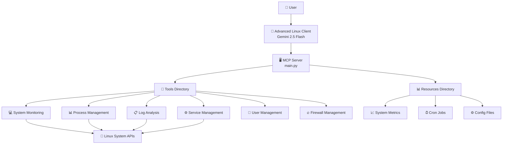

## 🏛️ Component Architecture

### High-Level Architecture


### Server Component Details

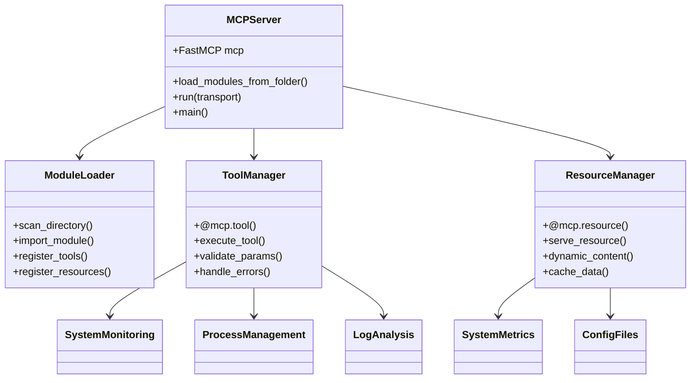

## 🔄 Data Flow Diagrams

### Complete System Data Flow

```mermaid
flowchart TD
    A[👤 User Input<br/>"Check CPU usage"] --> B[🤖 Gemini 2.5 Flash<br/>Query Analysis]
    B --> C{🧠 Intent Recognition}
    
    C -->|System Query| D[📋 Tool Selection<br/>get_cpu_usage]
    C -->|Help Request| E[❓ Help Tool]
    C -->|Complex Query| F[🔄 Multi-tool Chain]
    
    D --> G[🔧 Tool Execution]
    E --> G
    F --> G
    
    G --> H[🐧 Linux System Call<br/>psutil.cpu_percent()]
    H --> I[📊 Raw System Data]
    I --> J[🎯 Data Processing<br/>Format & Validate]
    J --> K[📤 Return to Client]
    K --> L[🤖 Gemini Analysis<br/>Format Response]
    L --> M[👤 User Response<br/>Formatted Answer]
    
    style A fill:#e1f5fe
    style M fill:#e8f5e8
    style H fill:#fff3e0
    style L fill:#f3e5f5
```

### Tool Discovery and Registration Flow

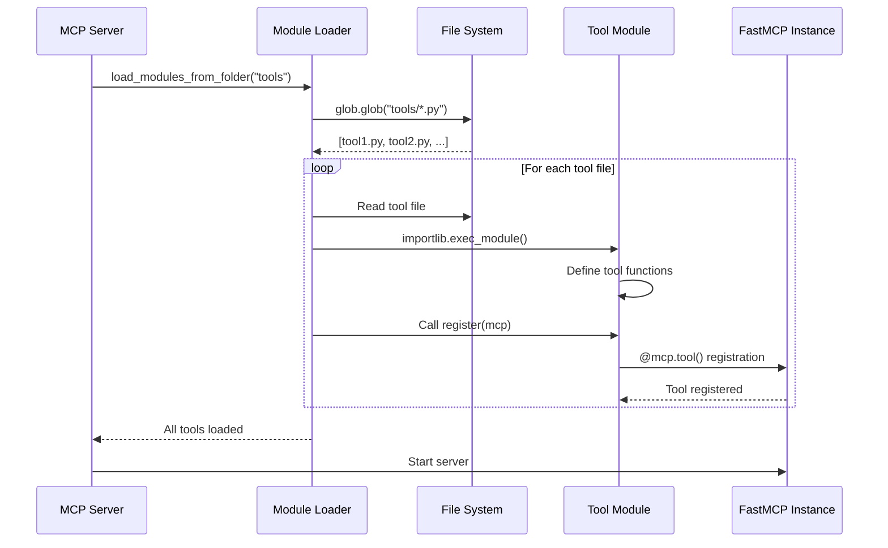

## 🔄 Sequence Diagrams

### User Query Processing Sequence

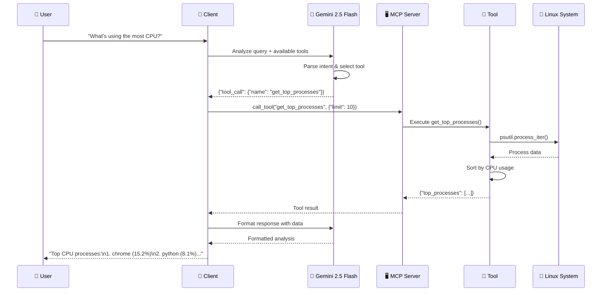

### Error Handling Flow

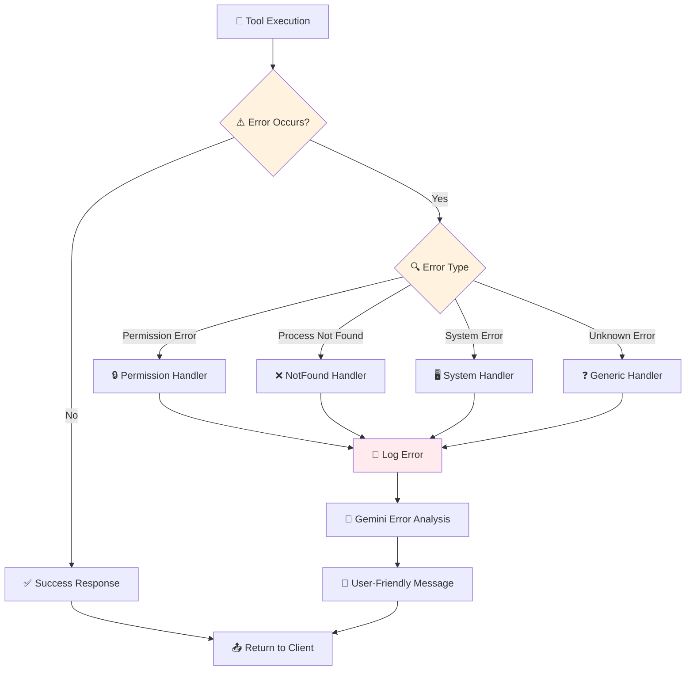

## 🔧 Module Loading Process

### Dynamic Module Discovery

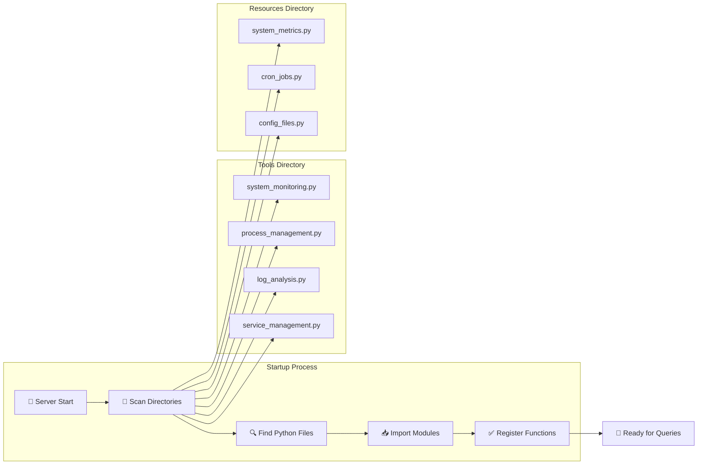

### Tool Registration Pattern

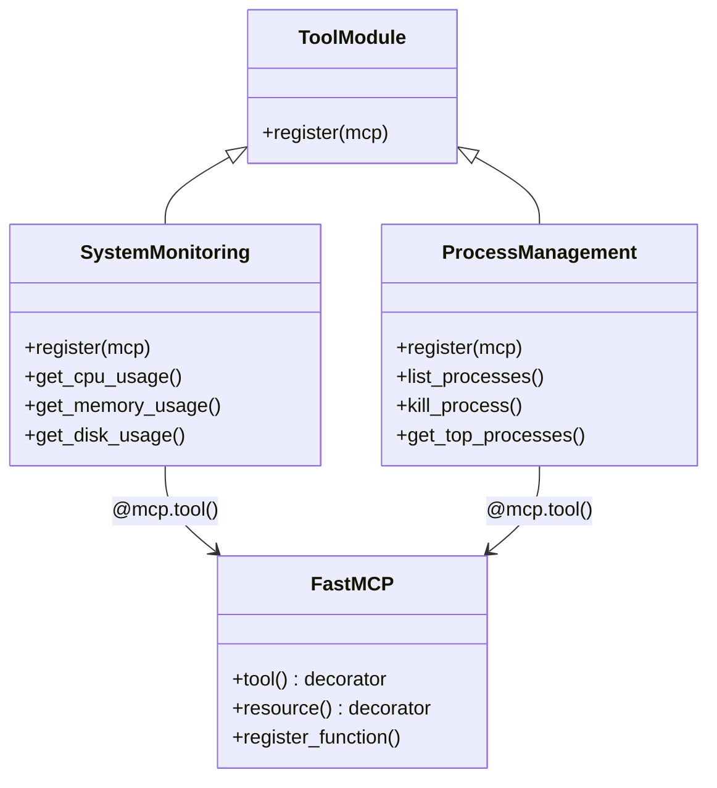

## ⚡ Tool Execution Flow

### System Monitoring Example

```mermaid
flowchart TD
    A[🎯 get_cpu_usage() called] --> B[📊 psutil.cpu_percent()]
    B --> C[🔢 psutil.cpu_count()]
    C --> D[📈 psutil.cpu_freq()]
    D --> E[⚖️ os.getloadavg()]
    
    E --> F{✅ All data collected?}
    F -->|Yes| G[📦 Package into dict]
    F -->|No| H[❌ Return error]
    
    G --> I[🔍 Validate data]
    I --> J[📤 Return JSON response]
    H --> J
    
    style A fill:#e3f2fd
    style J fill:#e8f5e8
    style H fill:#ffebee
```

### Process Management Example

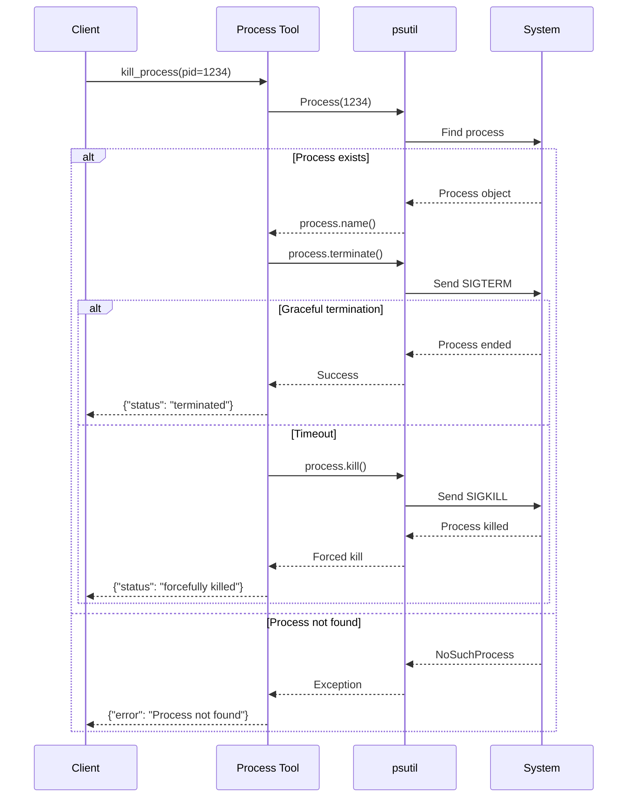

## 🛡️ Error Handling

### Error Classification and Handling

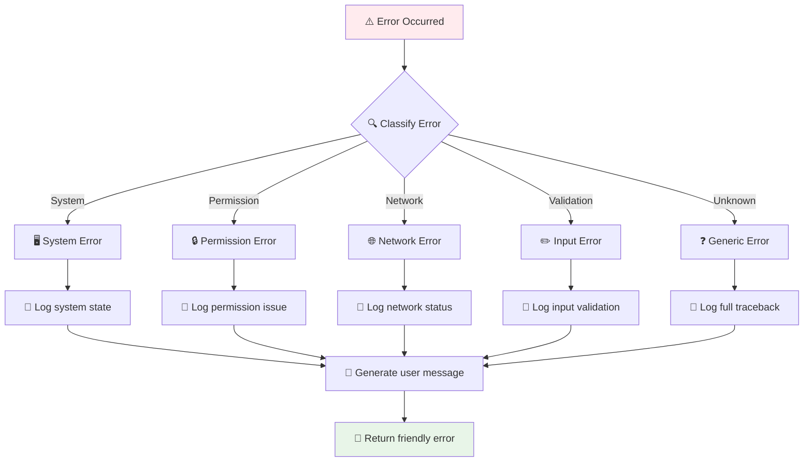

## 📊 Performance Considerations

### Optimization Strategies

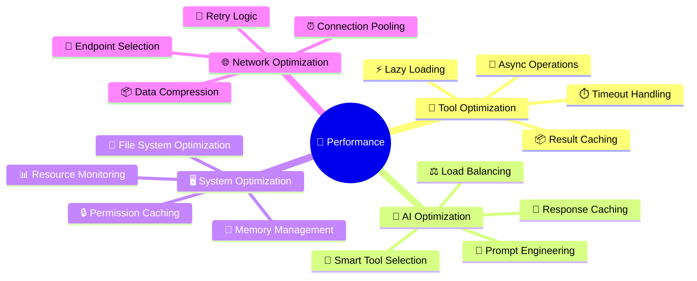

## 🔄 Comparison with Other MCP Architectures

### Architecture Comparison

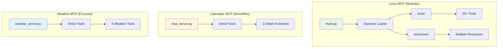

## 🎯 Key Architectural Benefits

### Modular Design Advantages

1. **🔧 Extensibility**: Add new tools by creating files in `tools/`
2. **📦 Maintainability**: Separate concerns in individual modules
3. **🧪 Testability**: Test individual components independently
4. **🔄 Scalability**: Easy to add new functionality without core changes
5. **👥 Team Development**: Multiple developers can work on different tools
6. **🛡️ Reliability**: Isolated failures don't affect other tools

### FastMCP Integration

```mermaid
graph LR
    A[FastMCP Framework] --> B[Tool Registration]
    A --> C[Resource Registration]
    A --> D[Transport Layer]
    A --> E[Error Handling]
    
    B --> F[@mcp.tool() Decorator]
    C --> G[@mcp.resource() Decorator]
    D --> H[STDIO/HTTP Support]
    E --> I[Graceful Degradation]
```

---

## 🌐 Remote Deployment Architectures

### Docker Deployment Architecture

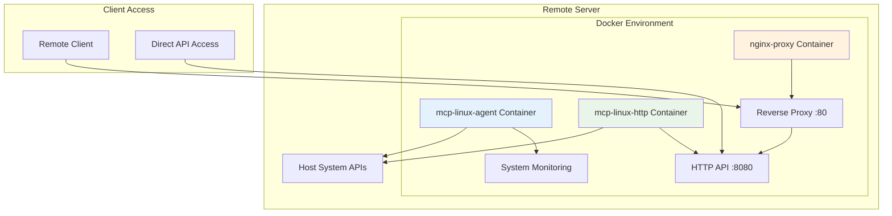

### Kubernetes Deployment Architecture

```mermaid
graph TB
    subgraph "Kubernetes Cluster"
        subgraph "mcp-system Namespace"
            A1[MCP Agent Pod] --> A2[Service :80]
            A1 --> A3[ConfigMap]
            A1 --> A4[Secret]
        end
        
        subgraph "Ingress"
            B1[Ingress Controller] --> A2
        end
        
        subgraph "Host Resources"
            C1[/proc] --> A1
            C2[/sys] --> A1
            C3[Host Network] --> A1
        end
    end
    
    D1[External Client] --> B1
    
    style A1 fill:#e3f2fd
    style A2 fill:#e8f5e8
```

### AWS Terraform Deployment

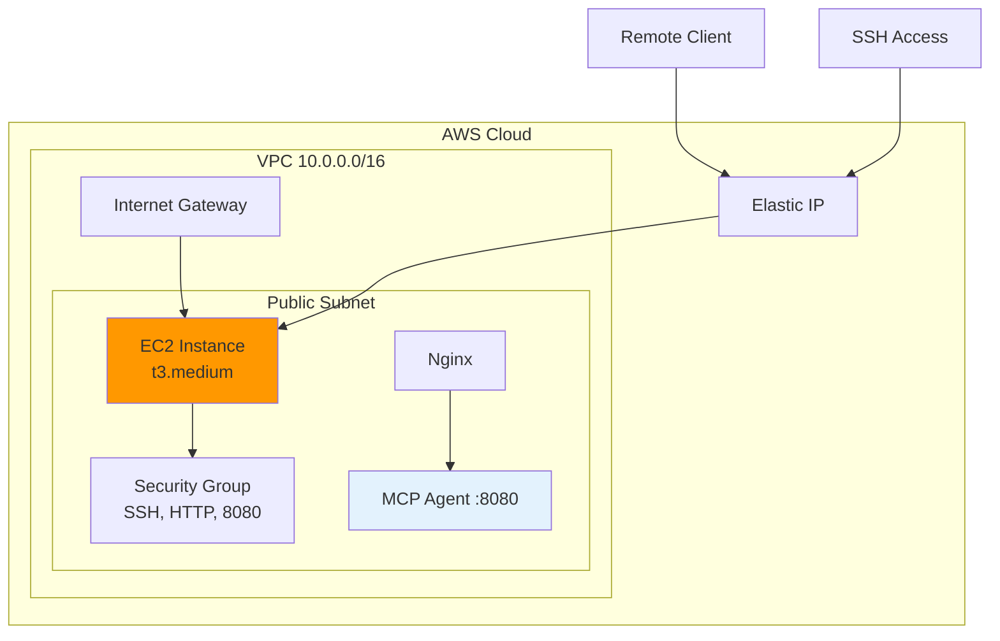

## 🚀 Deployment Strategies Comparison

### Deployment Options Matrix

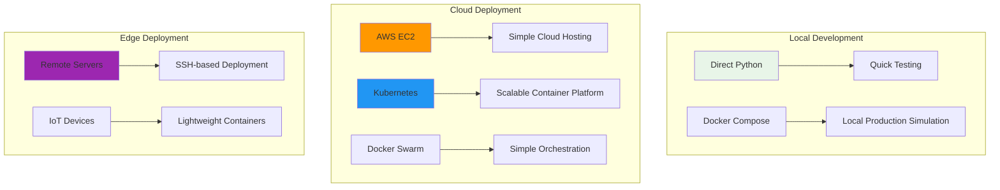

---

## 🌐 Production Deployment Guide

### Deployment Strategy Selection

| Use Case | Recommended Approach | Complexity | Scalability |
|----------|---------------------|------------|-------------|
| **Development** | Direct Python | Low | Low |
| **Small Production** | Docker Compose | Medium | Medium |
| **Enterprise** | Kubernetes | High | High |
| **Cloud-First** | AWS Terraform | Medium | High |
| **Edge Computing** | Remote SSH | Low | Low |

### Security Considerations for Remote Deployment

1. **🔒 Network Security**
   - Firewall configuration (UFW/iptables)
   - VPN access for management
   - SSL/TLS termination

2. **🔐 Authentication & Authorization**
   - API key management
   - Role-based access control
   - Service account permissions

3. **📊 Monitoring & Logging**
   - Centralized log aggregation
   - Health check endpoints
   - Performance monitoring

4. **🔄 Updates & Maintenance**
   - Blue-green deployments
   - Rolling updates
   - Backup strategies

The Linux MCP system is designed to be **deployment-agnostic** and can run efficiently across various infrastructure patterns while maintaining consistent functionality and security standards.
