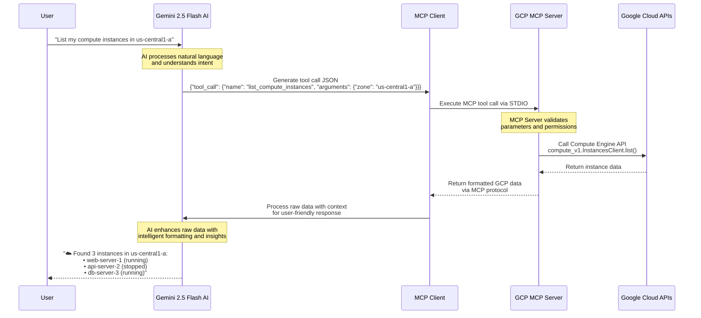
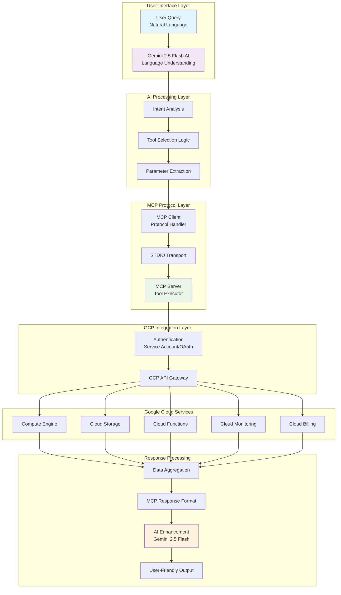
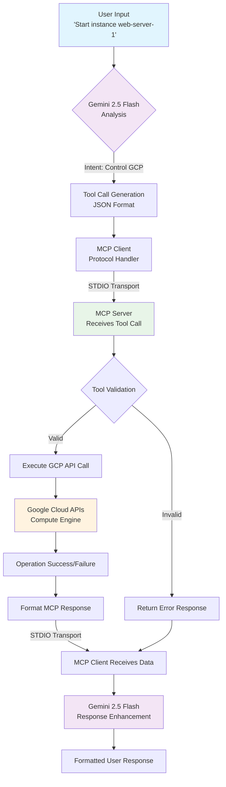
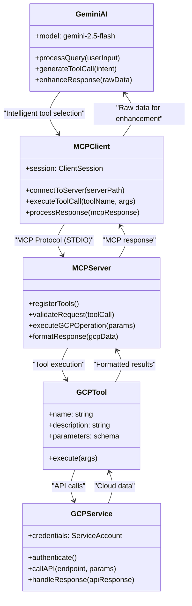

# GCP Cloud Management MCP Server ☁️

A comprehensive Google Cloud Platform management agent built with the Model Context Protocol (MCP) and powered by Gemini 2.5 Flash AI.

## Features

✅ **Compute Engine**: Instance management across zones  
✅ **Cloud Storage**: Bucket and object operations  
✅ **Cloud Functions**: Serverless function management and invocation  
✅ **Cloud Monitoring**: Metrics and performance data  
✅ **Billing Information**: Cost tracking and analysis  
✅ **Multi-Zone Support**: Work across all GCP zones and regions  
✅ **Natural Language Interface**: Powered by Gemini 2.5 Flash  

## Architecture Overview

### MCP Protocol & AI Integration Flow



### System Architecture



### MCP Protocol Communication Flow



### Tool Calling Architecture



## Prerequisites

- Python 3.8+
- GCP credentials configured (gcloud CLI or service account)
- Google AI API key for Gemini 2.5 Flash
- Required IAM permissions for GCP services

## Quick Start

```bash
# Install dependencies
pip install -r requirements.txt

# Configure GCP credentials (choose one method)
gcloud auth application-default login  # gcloud CLI
# OR set service account key
export GOOGLE_APPLICATION_CREDENTIALS=path/to/service-account.json

# Run the server
python3 gcp_client.py gcp_server.py
```

## Usage Examples

**Compute Engine:**
- "List compute instances in us-central1-a"
- "Start instance web-server-1"
- "Stop instance web-server-1"

**Cloud Storage:**
- "List all storage buckets"
- "Show objects in bucket my-data-bucket"

**Cloud Functions:**
- "List Cloud Functions in us-central1"
- "Invoke function my-function"

**Cloud Monitoring:**
- "Get CPU metrics for the last 2 hours"
- "Show memory utilization metrics"

## How MCP Enables Intelligent Cloud Management

### 1. **Protocol Standardization**
MCP provides a standardized interface between AI models and cloud tools, enabling:
- Consistent tool discovery and registration
- Type-safe parameter passing
- Reliable error handling
- Transport-agnostic communication

### 2. **AI-Driven Tool Selection**
Gemini 2.5 Flash analyzes user queries and automatically:
- Identifies the appropriate GCP service
- Selects the correct tool from available options
- Extracts and formats required parameters
- Handles complex multi-step operations

### 3. **Seamless Integration**
The MCP protocol bridges the gap between:
- Natural language user interface
- Structured API calls to Google Cloud
- Rich, contextual response generation

## Available Tools

| Category | Tools | Description |
|----------|-------|-------------|
| **Compute Engine** | `list_compute_instances`, `start_compute_instance`, `stop_compute_instance` | VM management |
| **Cloud Storage** | `list_storage_buckets`, `get_storage_bucket_objects` | Storage management |
| **Cloud Functions** | `list_cloud_functions`, `invoke_cloud_function` | Serverless functions |
| **Cloud Monitoring** | `get_monitoring_metrics` | Performance metrics |
| **Billing** | `get_gcp_billing_info` | Cost information |

## Security Best Practices

- Use service accounts with minimal permissions
- Enable audit logging
- Regularly review IAM permissions
- Use VPC security controls

## Sample Queries

- "What Compute instances are running in us-west1-a?"
- "Start instance my-vm in us-central1-a"
- "How many storage buckets do I have?"
- "List my Cloud Functions and their runtimes"
- "Show CPU usage for the last hour"

## Technical Benefits of MCP

### For Developers
- **Rapid Prototyping**: Build cloud management tools quickly
- **Type Safety**: Schema-validated tool parameters
- **Error Handling**: Consistent error responses across tools
- **Extensibility**: Easy to add new cloud services

### For Users
- **Natural Language**: No need to learn complex CLI commands
- **Intelligent Assistance**: AI understands context and intent
- **Consistent Experience**: Same interface across all cloud services
- **Real-time Feedback**: Immediate responses to cloud operations

### For Operations
- **Audit Trail**: Complete logging of all operations
- **Permission Control**: Fine-grained access control
- **Monitoring**: Built-in performance and error monitoring
- **Scalability**: Handle multiple concurrent operations
