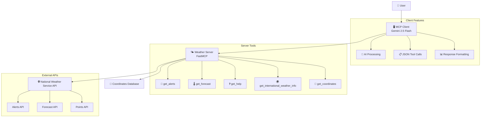
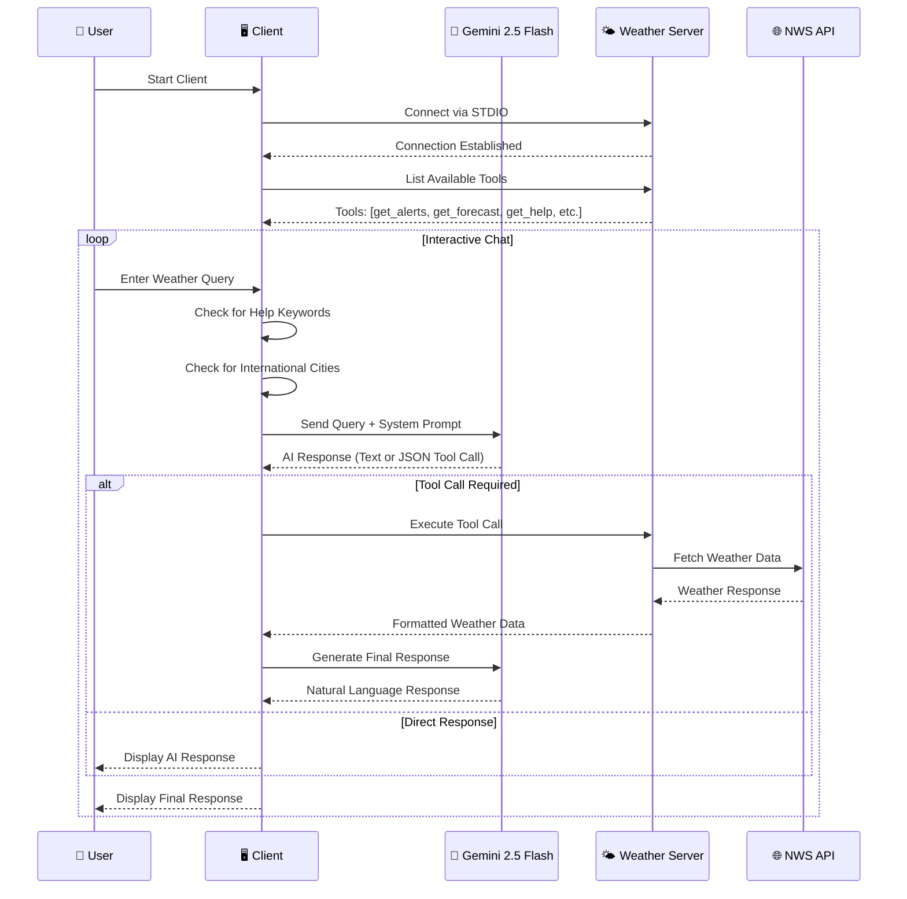
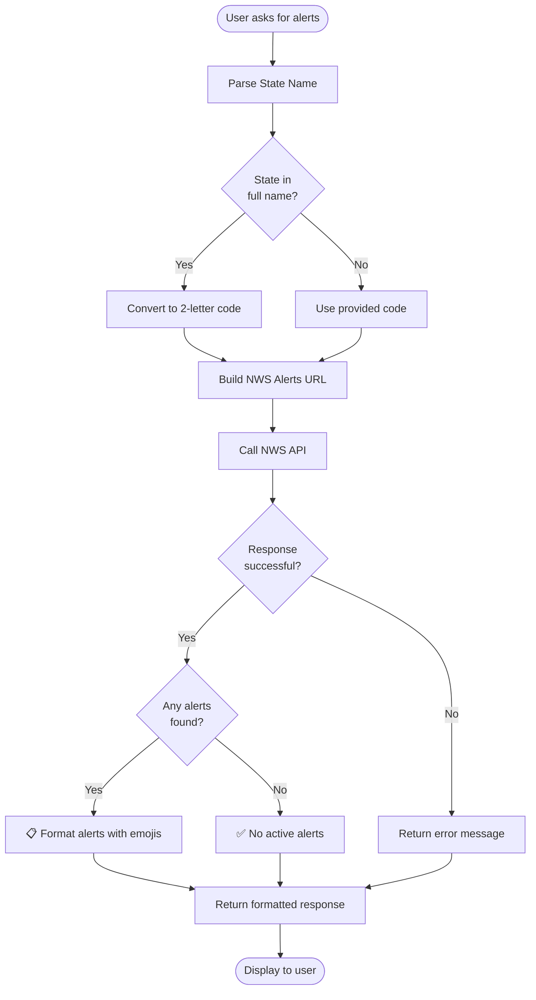
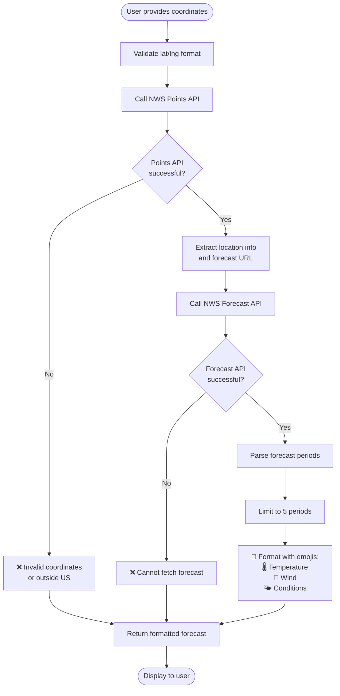
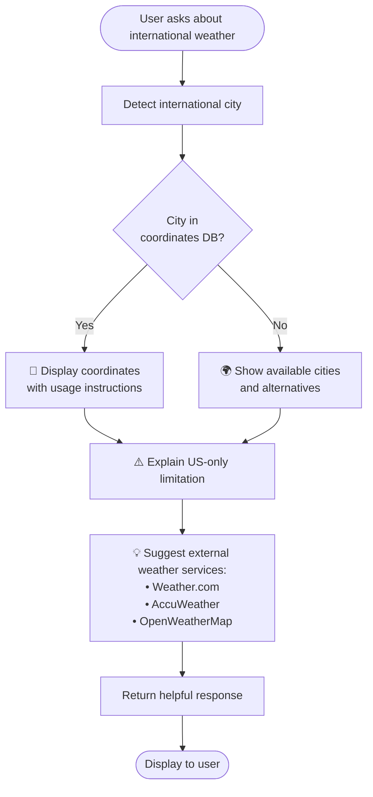
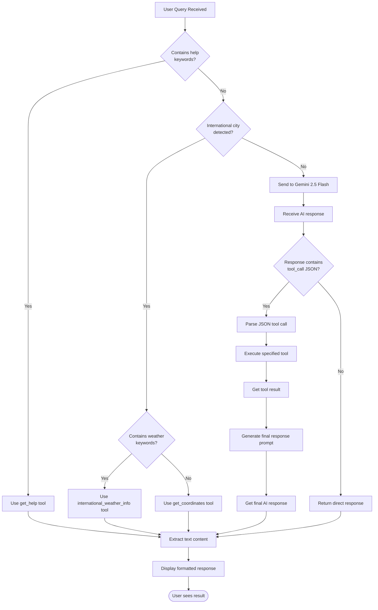
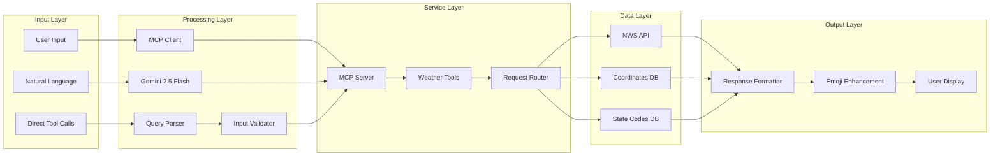
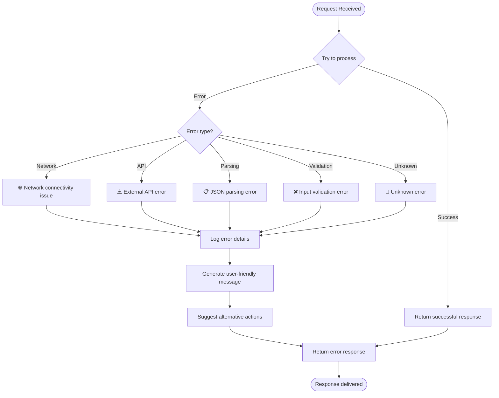
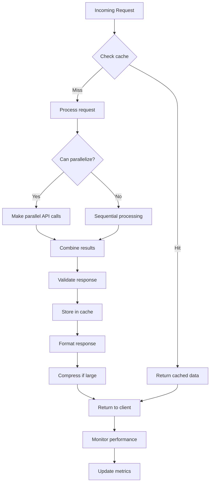
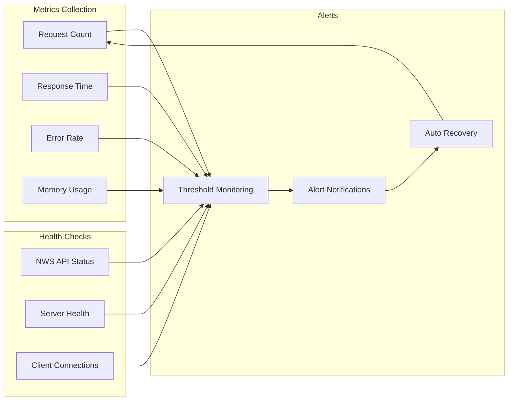

# MCP Weather Server Flow Documentation

This document provides comprehensive flow diagrams showing how the MCP Weather Server operates, from client connection to weather data delivery.

## 🏗️ Overall System Architecture

## 🔄 Complete User Interaction Flow

## 🛠️ Tool-Specific Flows

### 🚨 Weather Alerts Flow (US States)

### 🌡️ Weather Forecast Flow (US Coordinates)

### 🌍 International Weather Flow

## 🤖 AI Processing Flow

## 📊 Data Flow Architecture

## 🔧 Error Handling Flow

## 🚀 Performance Optimization Flow

## 📈 System Monitoring Flow

## 🎯 Key Features Summary

| Feature | Description | Implementation |
|---------|-------------|----------------|
| 🤖 **AI Integration** | Gemini 2.5 Flash for natural language processing | Advanced prompt engineering with tool calling |
| 🌍 **International Support** | Coordinates and guidance for global locations | Built-in city database with 30+ major cities |
| 🚨 **Real-time Alerts** | Live weather alerts for all US states | Direct NWS API integration |
| 📍 **Precise Forecasts** | Coordinate-based weather forecasts | NWS Points → Forecast API chain |
| 🔧 **Error Resilience** | Comprehensive error handling | Multiple fallback strategies |
| 📱 **User-Friendly** | Intuitive emoji-rich responses | Enhanced formatting and clear guidance |

---

*This flow documentation provides a complete overview of the MCP Weather Server architecture, helping developers understand the system's operation and extend its capabilities.*
