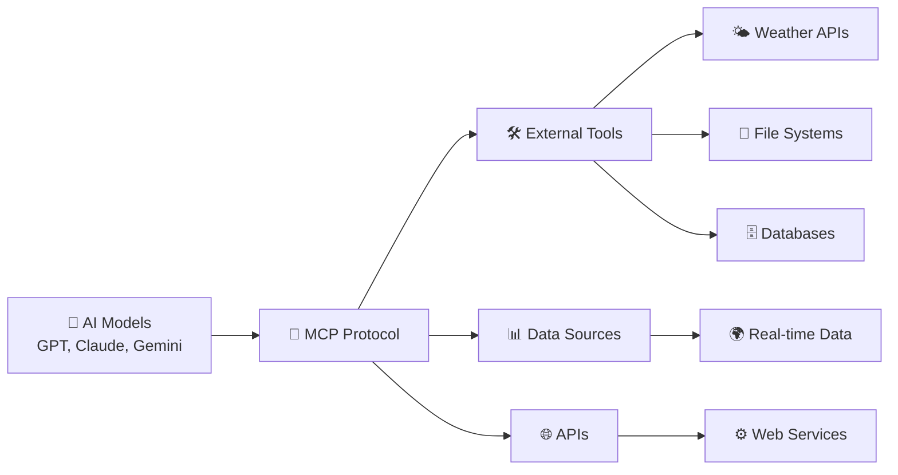
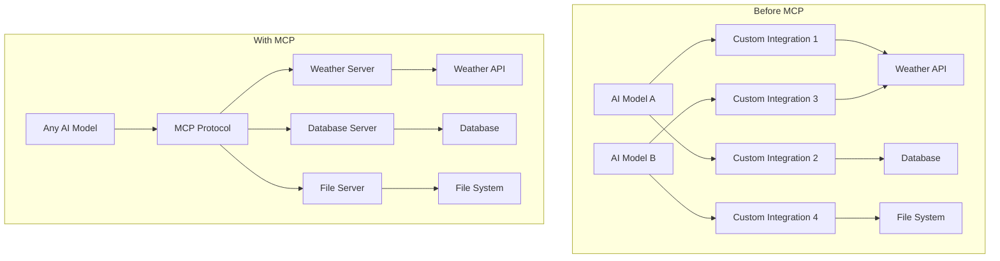
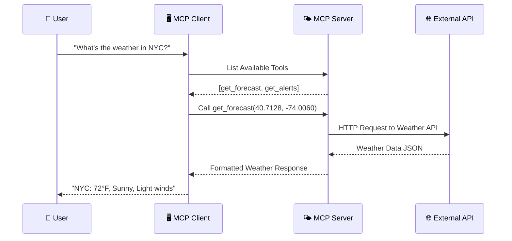
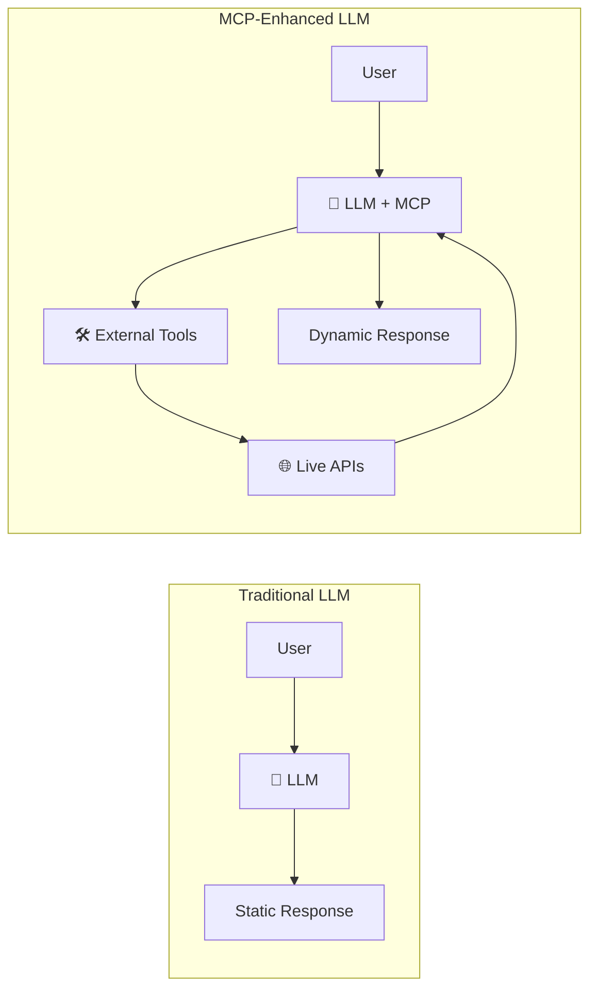
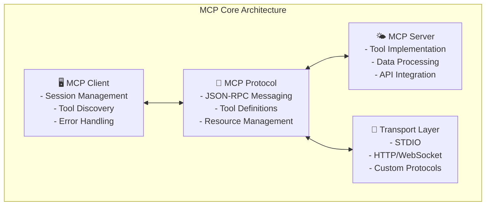

# Model Context Protocol (MCP) Presentation

## Slide 1: What is MCP? 🔗

### Model Context Protocol - Bridging AI and Real-World Data



**Key Points:**
- 🎯 **Standardized Protocol** for AI-tool communication
- 🔌 **Universal Interface** between AI models and external systems
- 🌉 **Bridge** connecting AI reasoning with real-world capabilities
- 📡 **Secure Communication** with proper authentication and error handling

---

## Slide 2: Why Do We Need MCP? 🤔

### The Problem Without MCP



**Problems Solved:**
- ❌ **No Standardization** - Each AI needs custom integrations
- 🔄 **Code Duplication** - Same functionality written multiple times
- 🐛 **Maintenance Nightmare** - Updates needed everywhere
- 🔒 **Security Issues** - Inconsistent authentication methods
- 📈 **Scalability Problems** - Hard to add new capabilities

---

## Slide 3: How MCP Works 🔧

### Core Architecture & Communication Flow



**Key Components:**
- 🔌 **Transport Layer** - STDIO, HTTP, WebSockets
- 📋 **Message Protocol** - JSON-RPC based communication
- 🛠️ **Tool Discovery** - Dynamic tool enumeration
- 🔐 **Security** - Authentication and authorization
- 📊 **Data Types** - Structured parameter validation

---

## Slide 4: Weather MCP Server Example 🌤️

### Real-World Implementation

```python
# MCP Weather Server Implementation
@mcp.tool()
async def get_forecast(latitude: float, longitude: float) -> str:
    """Get weather forecast for coordinates"""
    # 1. Validate coordinates
    # 2. Call National Weather Service API
    # 3. Format response with emojis and structure
    return formatted_weather_data

@mcp.tool()
async def get_alerts(state: str) -> str:
    """Get weather alerts for US states"""
    # 1. Convert state name to code
    # 2. Fetch active alerts
    # 3. Format with severity indicators
    return formatted_alerts
```

**Available Tools:**
- 🌡️ **get_forecast()** - Detailed weather forecasts
- 🚨 **get_alerts()** - Weather warnings and alerts
- 📍 **get_coordinates()** - City coordinate lookup
- 🌍 **get_international_weather_info()** - Global weather guidance
- ❓ **get_help()** - Usage examples and documentation

---

## Slide 5: MCP vs Traditional LLM Approach 🆚

### Comparison Matrix

| Aspect | Traditional LLM | MCP-Enhanced LLM |
|--------|----------------|------------------|
| **Data Access** | ❌ Static training data only | ✅ Real-time external data |
| **Tool Usage** | ❌ No external capabilities | ✅ Rich tool ecosystem |
| **Accuracy** | ⚠️ May hallucinate facts | ✅ Verified external data |
| **Flexibility** | ❌ Fixed capabilities | ✅ Extensible with new tools |
| **Real-time** | ❌ No current information | ✅ Live data integration |
| **Scalability** | ❌ Limited to model size | ✅ Unlimited external resources |



---

## Slide 6: Benefits of MCP 🎯

### Why MCP is Game-Changing

#### **For Developers** 👨‍💻
- 🔄 **Reusable Servers** - Write once, use with any AI model
- 🛠️ **Standardized APIs** - Consistent tool interface
- 🚀 **Rapid Development** - Focus on business logic, not integration
- 🔧 **Easy Maintenance** - Centralized tool management

#### **For AI Applications** 🤖
- 📈 **Enhanced Capabilities** - Access to unlimited external tools
- 🎯 **Improved Accuracy** - Real-time, verified data
- 🌍 **Global Reach** - Connect to any API or service
- 🔒 **Better Security** - Standardized authentication

#### **For Users** 👥
- ⚡ **Real-time Information** - Always current data
- 🎨 **Rich Interactions** - Complex multi-step workflows
- 🌐 **Broader Functionality** - AI that can actually "do" things
- 📱 **Consistent Experience** - Same tools across different AI models

---

## Slide 7: Core MCP Facts & Architecture 📋

### Essential MCP Components



**Key Technical Facts:**
- 📋 **Protocol Version**: JSON-RPC 2.0 based
- 🔄 **Transport Options**: STDIO, HTTP, WebSockets, SSE
- 🛠️ **Tool Types**: Functions, Resources, Prompts
- 📊 **Data Validation**: JSON Schema validation
- 🔐 **Security**: OAuth, API keys, custom auth
- 📈 **Scalability**: Async/await, connection pooling

---

## Slide 8: Building MCP Servers 🏗️

### Development Guide & Best Practices

#### **Quick Start Process**
```python
# 1. Initialize FastMCP Server
from mcp.server.fastmcp import FastMCP
mcp = FastMCP("my-server")

# 2. Define Tools
@mcp.tool()
async def my_tool(param: str) -> str:
    """Tool description for AI understanding"""
    # Your implementation here
    return result

# 3. Run Server
if __name__ == "__main__":
    mcp.run(transport='stdio')
```

#### **Development Best Practices** ✅
- 📝 **Clear Documentation** - Detailed tool descriptions
- 🔍 **Input Validation** - Robust parameter checking
- ⚡ **Async Operations** - Non-blocking API calls
- 🎨 **Rich Formatting** - User-friendly responses with emojis
- 🔧 **Error Handling** - Graceful failure management
- 🧪 **Testing** - Comprehensive tool testing

#### **Popular MCP Libraries** 📚
- 🐍 **Python**: `mcp`, `fastmcp`
- 🟨 **JavaScript**: `@modelcontextprotocol/sdk`
- 🦀 **Rust**: `mcp-rust-sdk`
- 🔷 **TypeScript**: Full type safety support

#### **Deployment Options** 🚀
- 📦 **Local Development** - STDIO transport
- 🌐 **Web Services** - HTTP/WebSocket servers
- ☁️ **Cloud Functions** - Serverless deployment
- 🐳 **Containerized** - Docker deployment

---

## 🎯 Key Takeaways

1. **MCP revolutionizes AI capabilities** by providing standardized tool access
2. **Real-time data integration** makes AI responses accurate and current
3. **Developer productivity** increases with reusable, standardized servers
4. **Weather MCP example** demonstrates practical real-world applications
5. **Easy to build** - Simple APIs with powerful capabilities
6. **Future-proof** - Extensible architecture for growing AI needs

---

*For more information and examples, visit: [Model Context Protocol Documentation](https://modelcontextprotocol.io/)*
